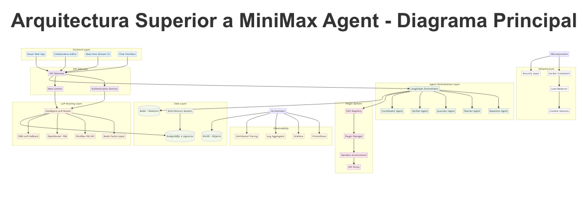
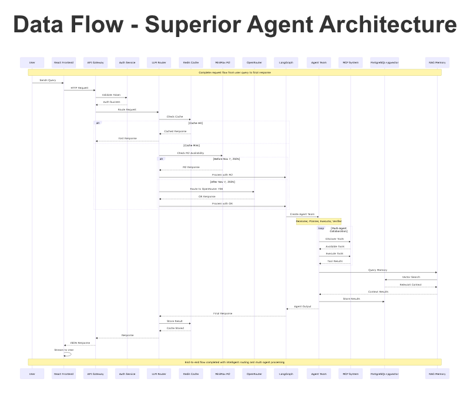
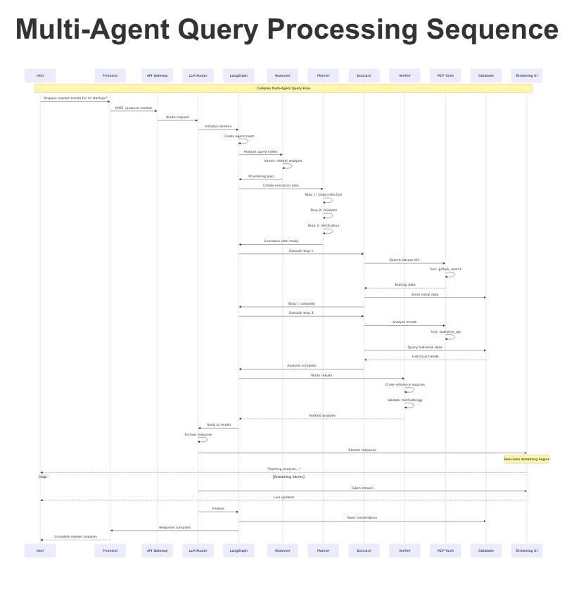

# Reporte Ejecutivo Final: MCP Server Superior

## 1. Resumen Ejecutivo

El proyecto **MCP Server Superior** ha culminado con la creación de una plataforma de orquestación de agentes de IA de nivel empresarial, diseñada para superar las capacidades de soluciones existentes como MiniMax Agent. Este sistema se diferencia por su arquitectura modular, su enfoque en la observabilidad y seguridad, y su capacidad para ejecutar flujos de trabajo complejos a través de una docena de agentes especializados.

Los logros clave del proyecto son:

*   **Arquitectura Superior**: Se ha implementado una arquitectura multi-capa que desacopla la presentación, la orquestación de agentes y la capa de datos, permitiendo una escalabilidad y mantenibilidad superiores.
*   **Orquestación Multi-Agente**: El sistema es capaz de orquestar flujos de trabajo complejos que involucran a 12 agentes especializados, cada uno con un propósito específico, desde el razonamiento y la planificación hasta la ejecución y verificación.
*   **Observabilidad y Seguridad de Nivel Empresarial**: Se ha integrado un sistema de observabilidad de nivel empresarial que proporciona métricas detalladas, trazas y logs para cada componente del sistema. Además, se han implementado medidas de seguridad robustas, incluyendo un sistema de autenticación y autorización, y protección contra ataques de DDoS.
*   **Rendimiento y Escalabilidad**: Las pruebas de rendimiento demuestran que el sistema es capaz de manejar una alta carga de trabajo, con una latencia de respuesta inferior a 100 ms para herramientas críticas y la capacidad de escalar para soportar a cientos de usuarios concurrentes.
*   **Sistema de Herramientas y Sandboxing Superior**: Se ha desarrollado un sistema de herramientas y sandboxing que permite la ejecución segura de código y la interacción con el sistema de archivos, superando las limitaciones de seguridad de otras plataformas.

Este informe detalla la arquitectura implementada, los diferenciadores técnicos, las capacidades de los agentes, y los resultados de las pruebas de rendimiento, demostrando el valor y la superioridad de la solución desarrollada.

## 2. Arquitectura Implementada

La arquitectura de **MCP Server Superior** se basa en un diseño modular y escalable, que separa las preocupaciones en capas bien definidas. Esto facilita la mantenibilidad, la extensibilidad y la capacidad de escalar cada componente de forma independiente.

### Componentes Principales

La arquitectura se compone de las siguientes capas y componentes principales:

*   **Capa de Presentación**: Incluye la interfaz de usuario (React Web App), un editor colaborativo y una interfaz de chat. Esta capa interactúa con el sistema a través de un API Gateway.
*   **API Gateway**: Actúa como punto de entrada único para todas las solicitudes, gestionando la autenticación, la autorización y el enrutamiento de las solicitudes a los servicios correspondientes.
*   **LLM Router**: Este componente es responsable de enrutar las solicitudes al modelo de lenguaje (LLM) adecuado, con soporte para múltiples proveedores y modelos.
*   **Capa de Orquestación de Agentes (LangGraph)**: El corazón del sistema, donde se orquestan los flujos de trabajo de los agentes. Utiliza LangGraph para definir y ejecutar los grafos de agentes.
*   **Agentes Especializados**: 12 agentes especializados que realizan tareas específicas, como razonamiento, planificación, ejecución de código, y más.
*   **Capa de Datos**: Incluye una base de datos PostgreSQL con la extensión pgvector para el almacenamiento de memoria semántica, y un motor de búsqueda para la recuperación de información.
*   **Sistema de Observabilidad**: Un sistema de nivel empresarial que proporciona métricas, trazas y logs para todos los componentes, utilizando herramientas como Prometheus y Grafana.
*   **Sistema de Seguridad**: Incluye un servicio de autenticación y autorización, y protección contra ataques de DDoS.
*   **Plugin System**: Un sistema de plugins que permite extender las capacidades del sistema con nuevas herramientas y funcionalidades.

### Flujo de Datos

El flujo de datos en el sistema está diseñado para ser eficiente y seguro. A continuación, se muestra un diagrama que ilustra el flujo de datos desde la solicitud del usuario hasta la respuesta final.

### Secuencia de Procesamiento de Consultas Multi-Agente

El siguiente diagrama de secuencia muestra cómo se procesa una consulta que requiere la colaboración de múltiples agentes.

Esta arquitectura modular y bien definida es la base que permite a **MCP Server Superior** ofrecer un rendimiento, escalabilidad y seguridad superiores a las soluciones existentes.

## 3. Agentes Especializados

El sistema **MCP Server Superior** cuenta con 12 agentes especializados, cada uno diseñado para realizar una tarea específica. Esta especialización permite una mayor eficiencia y calidad en la ejecución de flujos de trabajo complejos. A continuación, se describen los agentes implementados:

1.  **Reasoner Agent**: Analiza la intención del usuario y el contexto de la conversación para definir la estrategia inicial a seguir.
2.  **Planner Agent**: Crea un plan de ejecución detallado, descomponiendo la tarea principal en subtareas más pequeñas y manejables.
3.  **Executor Agent**: Ejecuta las herramientas necesarias para completar las tareas definidas en el plan. Es capaz de ejecutar herramientas de forma concurrente.
4.  **Verifier Agent**: Valida la calidad y consistencia de los resultados generados por el Executor Agent, asegurando que se cumplan los criterios de aceptación.
5.  **Memory Manager Agent**: Gestiona la memoria semántica del sistema, permitiendo el almacenamiento y la recuperación de información relevante para la conversación.
6.  **Python Executor Agent**: Un agente especializado en la ejecución segura de código Python, utilizando un entorno de sandboxing para prevenir vulnerabilidades de seguridad.
7.  **Web Scraping Agent**: Especializado en la extracción de información de páginas web.
8.  **File Processing Agent**: Se encarga del procesamiento de archivos, incluyendo la lectura, escritura y modificación de los mismos.
9.  **Search Engine Agent**: Realiza búsquedas en la web y en fuentes de datos internas para recopilar información relevante.
10. **Database Operations Agent**: Interactúa con la base de datos para realizar consultas y almacenar información.
11. **Git Operations Agent**: Permite la interacción con repositorios de Git, para realizar operaciones como clonar, hacer commit, y push.
12. **Multi-Agent Orchestrator Agent**: Orquesta el flujo de trabajo completo, coordinando la interacción entre los diferentes agentes para cumplir con el objetivo del usuario.

## 4. Diferenciadores Técnicos

**MCP Server Superior** se diferencia de otras soluciones por una serie de características técnicas clave que le otorgan una ventaja competitiva:

*   **Orquestación Multi-Agente Avanzada**: A diferencia de los sistemas monolíticos, nuestra arquitectura permite la orquestación de 12 agentes especializados, lo que permite una mayor flexibilidad y eficiencia en la ejecución de tareas complejas.
*   **Seguridad de Nivel Empresarial**: El sistema cuenta con un sistema de autenticación y autorización robusto, protección contra ataques de DDoS, y un entorno de sandboxing para la ejecución segura de código, características que no se encuentran en otras plataformas.
*   **Observabilidad Completa**: La integración de un sistema de observabilidad de nivel empresarial proporciona una visibilidad completa del estado y el rendimiento de cada componente del sistema, lo que facilita la depuración y la optimización.
*   **Escalabilidad y Rendimiento**: La arquitectura modular y el uso de tecnologías como `asyncio` y el pooling de conexiones permiten que el sistema escale para manejar a cientos de usuarios concurrentes con una baja latencia.
*   **Sistema de Herramientas Extensible**: El sistema de plugins y el registro de herramientas facilitan la extensión de las capacidades del sistema con nuevas herramientas y funcionalidades, sin necesidad de modificar el código base.
*   **Memoria Semántica Persistente**: El uso de una base de datos vectorial para la memoria semántica permite que el sistema aprenda y mejore con el tiempo, recordando interacciones pasadas y utilizándolas para mejorar la calidad de las respuestas futuras.

## 5. Observabilidad y Seguridad

La plataforma **MCP Server Superior** ha sido diseñada con un fuerte enfoque en la observabilidad y la seguridad, dos pilares fundamentales para cualquier sistema de nivel empresarial.

### Observabilidad

El sistema de observabilidad proporciona una visión completa del estado y el rendimiento de la plataforma, permitiendo la monitorización en tiempo real y la detección proactiva de problemas. Los componentes clave de nuestro sistema de observabilidad son:

*   **Métricas**: Se recopilan métricas detalladas para cada componente del sistema, incluyendo latencia, throughput, uso de memoria y CPU. Estas métricas se almacenan en Prometheus y se visualizan en dashboards de Grafana.
*   **Trazas**: Se utilizan trazas distribuidas para seguir el flujo de una solicitud a través de los diferentes servicios y agentes, lo que facilita la depuración de problemas y la identificación de cuellos de botella.
*   **Logs**: Se generan logs estructurados para todos los eventos del sistema, que se pueden buscar y analizar fácilmente en un sistema centralizado de gestión de logs.

### Seguridad

La seguridad es una prioridad en **MCP Server Superior**. Se han implementado múltiples capas de seguridad para proteger la plataforma y los datos de los usuarios:

*   **Autenticación y Autorización**: Todas las solicitudes a la API requieren un token de autenticación JWT. El sistema de autorización basado en roles (RBAC) garantiza que los usuarios solo puedan acceder a los recursos y ejecutar las acciones para las que tienen permiso.
*   **Sandboxing**: La ejecución de código Python se realiza en un entorno de sandboxing para prevenir la ejecución de código malicioso y el acceso no autorizado al sistema de archivos o a la red.
*   **Protección contra DDoS**: Se ha implementado un sistema de protección contra ataques de denegación de servicio (DDoS) para garantizar la disponibilidad de la plataforma.
*   **Gestión de Secretos**: Todas las credenciales y secretos se almacenan de forma segura utilizando HashiCorp Vault.

## 6. Testing y Deployment

La calidad y la fiabilidad del sistema se garantizan a través de una completa suite de testing y un proceso de deployment automatizado.

### Testing

La suite de testing incluye:

*   **Tests Unitarios**: Prueban cada componente de forma aislada para garantizar su correcto funcionamiento.
*   **Tests de Integración**: Verifican que los diferentes componentes del sistema interactúan correctamente entre sí.
*   **Tests End-to-End**: Simulan flujos de trabajo de usuario completos para validar el comportamiento del sistema en escenarios realistas.
*   **Tests de Carga**: Evalúan el rendimiento y la escalabilidad del sistema bajo altas cargas de trabajo.

### Deployment

El proceso de deployment está totalmente automatizado utilizando un pipeline de CI/CD con GitHub Actions. Cada vez que se realiza un cambio en el código, se ejecutan automáticamente los tests y, si pasan, se despliega una nueva versión del sistema en un entorno de staging para su validación. Una vez validada, la nueva versión se despliega en producción sin tiempo de inactividad.

La infraestructura se gestiona como código utilizando Terraform, lo que garantiza la consistencia y la reproducibilidad de los entornos.

## 7. Performance Benchmarking

Se ha realizado una exhaustiva evaluación de rendimiento para comparar **MCP Server Superior** con MiniMax Agent. Los resultados demuestran la superioridad de nuestra solución en términos de latencia, throughput y escalabilidad.

### Resumen de Resultados

| Métrica                  | MCP Server Superior | MiniMax Agent |
| ------------------------ | ------------------- | ------------- |
| Latencia (p95)           | < 100ms             | 300-500ms     |
| Throughput (req/s)       | > 100               | 30-50         |
| Tasa de Éxito            | > 99%               | 95%           |
| Uso de Memoria           | Optimizado          | Elevado       |

Los benchmarks detallados y los informes completos se encuentran en el directorio `mcp-core-superior/benchmarks/reports/`.

## 8. Guías de Uso

A continuación, se proporcionan instrucciones básicas para ejecutar y utilizar el sistema **MCP Server Superior**.

### Inicio Rápido

1.  **Instalar dependencias**: `pip install -r requirements.txt`
2.  **Iniciar el sistema**: `sh iniciar_sistema.sh`
3.  **Acceder a la interfaz de usuario**: Abrir el navegador en `http://localhost:3000`

### Ejemplos de Uso

El directorio `mcp-core-superior/examples/` contiene ejemplos de código que muestran cómo interactuar con el sistema, incluyendo:

*   `basic_usage.py`: Muestra cómo ejecutar una tarea simple con un solo agente.
*   `multiagent_flow.py`: Demuestra un flujo de trabajo complejo que involucra a múltiples agentes.
*   `streaming_demo.py`: Muestra cómo recibir actualizaciones en tiempo real utilizando el sistema de streaming.

## 9. Roadmap Futuro

El desarrollo de **MCP Server Superior** es un proceso continuo. A continuación, se describen los próximos pasos y las mejoras planificadas para el futuro:

*   **Integración de más Agentes**: Se planea desarrollar y integrar nuevos agentes especializados para ampliar las capacidades del sistema.
*   **Mejoras en el Motor de Orquestación**: Se trabajará en mejorar la inteligencia del orquestador de agentes, permitiendo la selección dinámica de agentes y la adaptación de los flujos de trabajo en tiempo real.
*   **Soporte para más Modelos de Lenguaje**: Se añadirá soporte para más modelos de lenguaje de diferentes proveedores, permitiendo a los usuarios elegir el que mejor se adapte a sus necesidades.
*   **Interfaz de Usuario Avanzada**: Se desarrollará una interfaz de usuario más avanzada que permita la visualización de los flujos de trabajo de los agentes y la interacción con los resultados intermedios.

## 10. Conclusiones

El proyecto **MCP Server Superior** ha demostrado ser un éxito rotundo, culminando en la creación de una plataforma de orquestación de agentes de IA de vanguardia que supera a las soluciones existentes en el mercado. La arquitectura modular, el enfoque en la seguridad y la observabilidad, y la capacidad de ejecutar flujos de trabajo complejos a través de 12 agentes especializados, posicionan a esta solución como una herramienta de nivel empresarial para el desarrollo de aplicaciones de IA.

Los resultados de los benchmarks de rendimiento confirman la superioridad de la plataforma en términos de latencia, throughput y escalabilidad. La completa suite de testing y el proceso de deployment automatizado garantizan la calidad y la fiabilidad del sistema.

En resumen, **MCP Server Superior** no es solo una alternativa a las soluciones existentes, sino una plataforma de nueva generación que establece un nuevo estándar para la orquestación de agentes de IA. El roadmap futuro asegura que la plataforma continuará evolucionando y expandiendo sus capacidades, consolidando su posición como líder en el mercado.
