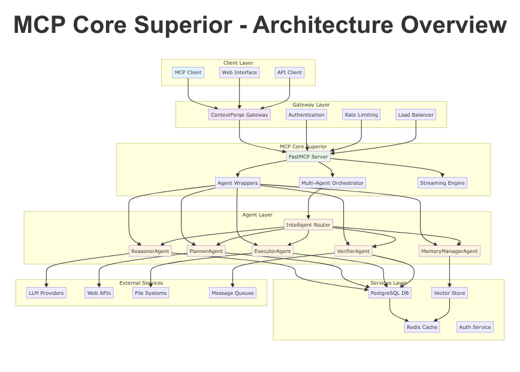
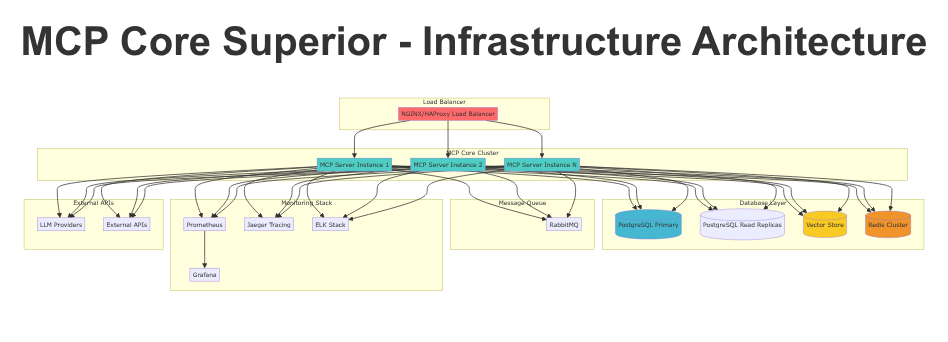

# Arquitectura del Sistema

## Overview

El MCP Core Superior implementa una arquitectura modular y escalable diseñada para orquestar múltiples agentes de IA de manera eficiente. La arquitectura se basa en principios de microservicios, con componentes desacoplados que permiten escalabilidad horizontal y mantenimiento independiente.

## 🏗️ Principios Arquitectónicos

### 1. **Modularidad**
- Componentes independientes con responsabilidades claras
- Interfaces bien definidas entre componentes
- Facilidad para替换 y actualización de componentes individuales

### 2. **Escalabilidad**
- Diseño horizontal desde el núcleo
- Stateless donde sea posible para facilitar load balancing
- Gestión eficiente de recursos compartidos

### 3. **Observabilidad**
- Instrumentación completa en todos los niveles
- Métricas, logging y tracing integrados
- Monitoreo proactivo y alertas inteligentes

### 4. **Resiliencia**
- Tolerancia a fallos en componentes individuales
- Circuit breakers y retry mechanisms
- Graceful degradation bajo carga

## 📐 Visión General de la Arquitectura



La arquitectura se organiza en 7 capas principales:

### 🌐 **Client Layer**
- **MCP Clients**: Clientes que se conectan via protocolo MCP
- **Web Interfaces**: Interfaces web que consumen APIs REST
- **API Clients**: Aplicaciones que integran directamente las APIs

### 🚪 **Gateway Layer**
- **ContextForge Gateway**: Gateway de entrada con gestión de API keys
- **Authentication**: Validación de tokens JWT y gestión de sesiones
- **Rate Limiting**: Control de rate limiting por usuario y API key
- **Load Balancer**: Distribución de carga entre instancias

### ⚡ **MCP Core Superior**
- **FastMCP Server**: Servidor principal que maneja conexiones MCP
- **Agent Wrappers**: Wrappers que exponen agentes como herramientas MCP
- **Multi-Agent Orchestrator**: Orquestador que coordina flujos multi-agente
- **Streaming Engine**: Engine que maneja streaming SSE en tiempo real

### 🤖 **Agent Layer**
- **ReasonerAgent**: Análisis de intención y estrategia
- **PlannerAgent**: Planificación y descomposición de tareas
- **ExecutorAgent**: Ejecución de herramientas y operaciones
- **VerifierAgent**: Validación y verificación de calidad
- **MemoryManagerAgent**: Gestión de memoria y contexto
- **Intelligent Router**: Sistema de routing inteligente con ML

### 🛠️ **Services Layer**
- **PostgreSQL Database**: Almacenamiento principal de datos
- **Vector Store**: Almacenamiento vectorial para búsquedas semánticas
- **Redis Cache**: Cache distribuido para performance
- **Auth Service**: Servicios de autenticación y autorización

### 🔌 **External Services**
- **LLM Providers**: OpenAI, Anthropic, Google, etc.
- **Web APIs**: APIs externas para datos y servicios
- **File Systems**: Almacenamiento de archivos y documentos
- **Message Queues**: RabbitMQ, Redis, Kafka para comunicación asíncrona

## 🏛️ Arquitectura Detallada por Componentes

### FastMCP Server
```python
class FastMCPServer:
    """
    Servidor principal que maneja conexiones MCP
    - Gestión de tool registry
    - Manejo de requests/responses
    - Validación de entrada/salida
    - Error handling y logging
    """
    
    async def handle_tool_call(self, tool_name: str, params: dict) -> dict
    async def register_tool(self, tool_name: str, handler: callable) -> None
    async def validate_params(self, schema: dict, params: dict) -> bool
```

### Agent Wrappers
```python
class BaseAgentWrapper:
    """
    Wrapper base para todos los agentes
    - Validación de entrada
    - Manejo de errores
    - Logging estructurado
    - Métricas de performance
    """
    
    async def wrap_tool_call(self, agent_method: str, **params) -> dict
    async def validate_input(self, params: dict) -> bool
    def get_mcp_tool_schema(self) -> dict
```

### Multi-Agent Orchestrator
```python
class MultiAgentOrchestrator:
    """
    Orquestador principal que coordina flujos multi-agente
    - Gestión de estado de tareas
    - Coordinación de agentes
    - Manejo de errores entre agentes
    - Streaming de progreso
    """
    
    async def orchestrate_flow(self, objective: str, context: dict) -> dict
    async def execute_reasoner(self, objective: str, context: dict) -> dict
    async def execute_planner(self, analysis: dict) -> dict
    async def execute_executor(self, plan: dict) -> dict
    async def execute_verifier(self, results: dict) -> dict
```

### Intelligent Router
```python
class IntelligentRouter:
    """
    Router inteligente con ML para optimización de routing
    - Predicción de performance usando Random Forest
    - A/B testing de estrategias
    - Aprendizaje continuo
    - Optimización multi-objetivo
    """
    
    async def predict_performance(self, request: dict) -> dict
    async def route_request(self, request: dict) -> str
    async def update_model(self, results: dict) -> None
    async def run_ab_test(self, strategy_a: str, strategy_b: str) -> dict
```

### Streaming Engine
```python
class StreamingEngine:
    """
    Engine para streaming de updates en tiempo real
    - Server-Sent Events (SSE)
    - Buffering y throttling
    - Connection management
    - Fallback mechanisms
    """
    
    async def stream_updates(self, task_id: str) -> AsyncIterator[str]
    async def create_sse_connection(self, task_id: str) -> SSEConnection
    async def send_update(self, connection: SSEConnection, update: dict) -> None
```

## 🔄 Data Flow Architecture


### Flujo de Datos Principal

1. **Request Ingestion**
   ```
   Client → Gateway → FastMCP Server → Tool Registry
   ```

2. **Agent Processing**
   ```
   Tool Handler → Agent Wrapper → Agent Core → External Services
   ```

3. **Data Storage**
   ```
   Agent → Services Layer → Database/Cache → Vector Store
   ```

4. **Response Streaming**
   ```
   Streaming Engine → SSE → Gateway → Client
   ```

### Patrones de Comunicación

#### Request-Response Síncrono
```python
# Para operaciones rápidas (< 100ms)
result = await agent_wrapper.call_agent_method(
    method="analyze_intent", 
    params={"objective": "query"}
)
```

#### Request-Response Asíncrono
```python
# Para operaciones largas (> 1s)
task_id = await agent_wrapper.submit_task(
    operation="execute_plan", 
    params={"plan": plan}
)
result = await task_manager.get_result(task_id)
```

#### Streaming Updates
```python
# Para operaciones de larga duración con progreso
async for update in streaming_client.stream_task_updates(task_id):
    print(f"Progress: {update['progress']}% - {update['message']}")
```

## 🔐 Security Architecture


### Capas de Seguridad

1. **Network Security**
   - TLS/SSL en todas las comunicaciones
   - VPN para comunicaciones internas
   - Firewall rules específicas

2. **API Gateway Security**
   - API Key authentication
   - Rate limiting por key
   - Request validation y sanitization

3. **Application Security**
   - JWT token validation
   - RBAC (Role-Based Access Control)
   - Input validation y sanitization

4. **Data Security**
   - Encryption at rest
   - Encryption in transit
   - Data masking para logs

5. **Infrastructure Security**
   - Container security scanning
   - Secret management
   - Audit logging

### Authentication Flow
```python
async def authenticate_request(request: Request) -> User:
    """
    Flujo de autenticación:
    1. Extract API key from header
    2. Validate API key via ContextForge Gateway
    3. Load user permissions
    4. Create user context
    """
    
    api_key = request.headers.get("X-API-Key")
    user = await gateway_client.validate_api_key(api_key)
    permissions = await load_user_permissions(user.id)
    
    return User(
        id=user.id,
        permissions=permissions,
        context=user.context
    )
```

## 📊 Performance Architecture

### Escalabilidad Horizontal
```python
# Load Balancer Configuration
upstream mcp_servers {
    server mcp-core-1:8080 weight=3;
    server mcp-core-2:8080 weight=3;
    server mcp-core-3:8080 weight=2;
    least_conn;
}

server {
    listen 443 ssl;
    location / {
        proxy_pass http://mcp_servers;
        proxy_set_header X-Real-IP $remote_addr;
        proxy_set_header X-Forwarded-For $proxy_add_x_forwarded_for;
    }
}
```

### Auto-scaling Strategy
```yaml
# Kubernetes HPA Configuration
apiVersion: autoscaling/v2
kind: HorizontalPodAutoscaler
metadata:
  name: mcp-core-hpa
spec:
  scaleTargetRef:
    apiVersion: apps/v1
    kind: Deployment
    name: mcp-core-superior
  minReplicas: 2
  maxReplicas: 20
  metrics:
  - type: Resource
    resource:
      name: cpu
      target:
        type: Utilization
        averageUtilization: 70
  - type: Resource
    resource:
      name: memory
      target:
        type: Utilization
        averageUtilization: 80
```

## 🚀 Deployment Architecture



### Multi-Environment Setup

#### Development
- Single Docker Compose stack
- Local PostgreSQL y Redis
- Hot reload habilitado
- Debug logging

#### Staging
- Kubernetes cluster con 3 replicas
- Shared database con datos de prueba
- Monitoring completo
- Integration tests automatizados

#### Production
- Multi-cluster Kubernetes
- Database clusters con replication
- Load balancers redundantes
- Full observability stack

### Configuration Management
```python
# Configuración por entorno
class Config:
    def __init__(self, environment: str):
        self.environment = environment
        self.config = self._load_config()
    
    def _load_config(self) -> dict:
        return {
            "development": {
                "database_url": "postgresql://localhost/dev",
                "redis_url": "redis://localhost:6379",
                "log_level": "DEBUG"
            },
            "production": {
                "database_url": os.getenv("DATABASE_URL"),
                "redis_url": os.getenv("REDIS_URL"),
                "log_level": "INFO"
            }
        }[self.environment]
```

## 🔧 Technology Stack Details

### Core Technologies
- **Python 3.11+**: Lenguaje principal
- **FastMCP**: Framework MCP
- **FastAPI**: Framework web
- **Pydantic**: Validación de datos
- **SQLAlchemy**: ORM para base de datos

### Data Layer
- **PostgreSQL 15+**: Base de datos principal
- **pgvector**: Extensión para vectores
- **Redis 7+**: Cache y sesiones
- **Alembic**: Migraciones de BD

### Monitoring & Observability
- **Prometheus**: Métricas y alertas
- **Grafana**: Dashboards
- **Jaeger**: Distributed tracing
- **ELK Stack**: Centralized logging

### ML & AI
- **scikit-learn**: Machine Learning para routing
- **NumPy**: Computación numérica
- **pandas**: Análisis de datos

### Infrastructure
- **Docker**: Containerización
- **Kubernetes**: Orquestación
- **Helm**: Package management
- **NGINX**: Load balancing

## 📈 Architecture Decisions

### Decisiones Clave

1. **MCP over REST para herramientas**
   - **Razón**: Protocolo estándar para herramientas AI
   - **Beneficio**: Interoperabilidad con ecosystem MCP

2. **FastMCP vs mcp-python-sdk**
   - **Razón**: Mejor performance y async support
   - **Beneficio**: <100ms latency para herramientas críticas

3. **PostgreSQL + pgvector**
   - **Razón**: ACID compliance + vector search
   - **Beneficio**: Consistencia de datos + búsqueda semántica

4. **SSE over WebSockets**
   - **Razón**: Simplicidad para server-to-client streams
   - **Beneficio**: Menor overhead para updates de estado

5. **Redis para cache distribuido**
   - **Razón**: High performance + clustering
   - **Beneficio**: Sub-millisecond cache access

### Trade-offs

| Decisión | Pros | Cons |
|----------|------|------|
| **FastMCP** | Alto performance, async nativo | Menos maduro que mcp-sdk |
| **PostgreSQL** | ACID, rich SQL | Vector ops menos optimizadas |
| **SSE** | Simple, server-to-client | No bidireccional |
| **Kubernetes** | Escalabilidad, resilience | Complejidad operacional |

---

## 🔮 Future Architecture Considerations

### Short-term (3-6 meses)
- [ ] Implementación de service mesh (Istio)
- [ ] Adición de chaos engineering
- [ ] Migración a event-driven architecture para ciertos flujos

### Medium-term (6-12 meses)
- [ ] Multi-tenancy architecture
- [ ] Plugin system para agentes custom
- [ ] GraphQL API alongside REST

### Long-term (12+ meses)
- [ ] Migration a microservicios más granulares
- [ ] Edge computing para latency-sensitive operations
- [ ] Advanced ML models para routing y prediction

---

**Última actualización**: 2025-11-04  
**Versión del documento**: 2.0.0