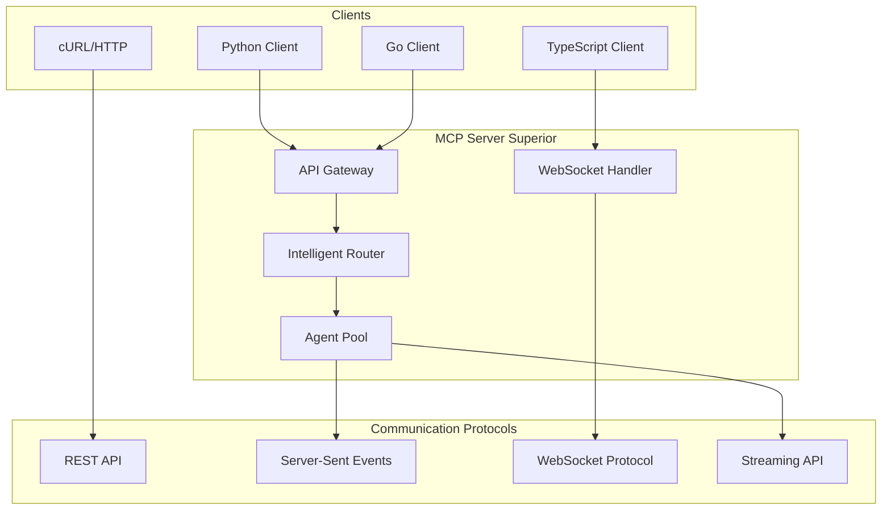

# Ejemplos de Integración

## Introducción

Esta guía proporciona ejemplos completos de integración del MCP Server Superior con diferentes tipos de clientes y lenguajes de programación. Incluye implementaciones prácticas para Python, TypeScript/JavaScript, Go y uso directo con cURL.

## Arquitectura de Integración



## 1. Cliente Python

### 1.1 Instalación y Configuración

```bash
# Instalar dependencias
pip install aiohttp asyncio websockets pydantic

# O usar requirements.txt
pip install -r requirements.txt
```

```python
# requirements.txt
aiohttp>=3.8.0
websockets>=11.0.0
pydantic>=2.0.0
asyncio-mqtt>=0.11.0
```

### 1.2 Cliente Python Básico

```python
# clients/python/mcp_client.py
import asyncio
import aiohttp
import json
import websockets
from typing import Dict, Any, List, Optional, Callable
from pydantic import BaseModel
import logging

# Configurar logging
logging.basicConfig(level=logging.INFO)
logger = logging.getLogger(__name__)

class MCPRequest(BaseModel):
    id: str
    method: str
    params: Dict[str, Any] = {}
    jsonrpc: str = "2.0"

class MCPResponse(BaseModel):
    id: str
    result: Optional[Dict[str, Any]] = None
    error: Optional[Dict[str, Any]] = None
    jsonrpc: str = "2.0"

class MCPPythonClient:
    """Cliente Python para MCP Server Superior"""
    
    def __init__(self, 
                 base_url: str = "http://localhost:8000",
                 ws_url: str = "ws://localhost:8000/ws",
                 timeout: int = 30):
        self.base_url = base_url
        self.ws_url = ws_url
        self.timeout = timeout
        self.session = None
        self.websocket = None
        self.request_id = 0
    
    async def __aenter__(self):
        """Context manager entry"""
        self.session = aiohttp.ClientSession(
            timeout=aiohttp.ClientTimeout(total=self.timeout)
        )
        return self
    
    async def __aexit__(self, exc_type, exc_val, exc_tb):
        """Context manager exit"""
        if self.session:
            await self.session.close()
        if self.websocket:
            await self.websocket.close()
    
    def _next_request_id(self) -> str:
        """Genera el siguiente ID de request"""
        self.request_id += 1
        return f"req_{self.request_id}"
    
    async def call_agent(self, 
                        agent_type: str, 
                        operation: str, 
                        data: Dict[str, Any],
                        priority: int = 5) -> Dict[str, Any]:
        """
        Llama a un agente específico
        
        Args:
            agent_type: Tipo de agente (reasoner, planner, executor, etc.)
            operation: Operación a realizar
            data: Datos para la operación
            priority: Prioridad (1-10, donde 10 es la más alta)
        
        Returns:
            Resultado de la operación
        """
        
        request = {
            "agent_type": agent_type,
            "operation": operation,
            "data": data,
            "priority": priority,
            "request_id": self._next_request_id()
        }
        
        try:
            async with self.session.post(
                f"{self.base_url}/api/v1/agents/call",
                json=request,
                headers={"Content-Type": "application/json"}
            ) as response:
                
                if response.status == 200:
                    result = await response.json()
                    return result
                else:
                    error_text = await response.text()
                    logger.error(f"Error calling agent: {response.status} - {error_text}")
                    raise Exception(f"HTTP {response.status}: {error_text}")
                    
        except aiohttp.ClientError as e:
            logger.error(f"Network error calling agent: {e}")
            raise
    
    async def multi_agent_workflow(self, 
                                  workflow: List[Dict[str, Any]]) -> Dict[str, Any]:
        """
        Ejecuta un workflow multi-agente
        
        Args:
            workflow: Lista de pasos del workflow
                    Cada paso: {
                        "step": 1,
                        "agent_type": "reasoner",
                        "operation": "analyze",
                        "data": {...},
                        "next_step": 2
                    }
        
        Returns:
            Resultados del workflow completo
        """
        
        request = {
            "workflow": workflow,
            "request_id": self._next_request_id()
        }
        
        try:
            async with self.session.post(
                f"{self.base_url}/api/v1/workflow/execute",
                json=request,
                headers={"Content-Type": "application/json"}
            ) as response:
                
                if response.status == 200:
                    result = await response.json()
                    return result
                else:
                    error_text = await response.text()
                    raise Exception(f"Workflow failed: {response.status} - {error_text}")
                    
        except Exception as e:
            logger.error(f"Error in multi-agent workflow: {e}")
            raise
    
    async def stream_results(self, 
                            request: Dict[str, Any],
                            callback: Callable[[Dict[str, Any]], None]):
        """
        Obtiene resultados en streaming (SSE)
        
        Args:
            request: Request inicial
            callback: Función para procesar cada resultado
        """
        
        params = {
            "request": json.dumps(request),
            "format": "json"
        }
        
        url = f"{self.base_url}/api/v1/stream/results"
        
        async with self.session.get(url, params=params) as response:
            if response.status != 200:
                raise Exception(f"Stream request failed: {response.status}")
            
            async for line in response.content:
                line = line.decode('utf-8').strip()
                
                if line.startswith('data: '):
                    data = json.loads(line[6:])  # Remover 'data: '
                    callback(data)
                    
                elif line == 'event: end':
                    break
    
    async def connect_websocket(self) -> bool:
        """Conecta al WebSocket para comunicación bidireccional"""
        try:
            self.websocket = await websockets.connect(self.ws_url)
            logger.info("WebSocket connected successfully")
            return True
        except Exception as e:
            logger.error(f"Failed to connect WebSocket: {e}")
            return False
    
    async def websocket_send(self, message: Dict[str, Any]):
        """Envía mensaje por WebSocket"""
        if not self.websocket:
            raise Exception("WebSocket not connected")
        
        await self.websocket.send(json.dumps(message))
    
    async def websocket_listen(self, callback: Callable[[Dict[str, Any]], None]):
        """Escucha mensajes del WebSocket"""
        if not self.websocket:
            raise Exception("WebSocket not connected")
        
        try:
            async for message in self.websocket:
                data = json.loads(message)
                callback(data)
        except websockets.exceptions.ConnectionClosed:
            logger.info("WebSocket connection closed")
    
    async def get_agent_status(self) -> Dict[str, Any]:
        """Obtiene el estado de todos los agentes"""
        try:
            async with self.session.get(
                f"{self.base_url}/api/v1/agents/status"
            ) as response:
                
                if response.status == 200:
                    return await response.json()
                else:
                    raise Exception(f"Failed to get agent status: {response.status}")
                    
        except Exception as e:
            logger.error(f"Error getting agent status: {e}")
            raise
    
    async def get_system_metrics(self) -> Dict[str, Any]:
        """Obtiene métricas del sistema"""
        try:
            async with self.session.get(
                f"{self.base_url}/api/v1/system/metrics"
            ) as response:
                
                if response.status == 200:
                    return await response.json()
                else:
                    raise Exception(f"Failed to get metrics: {response.status}")
                    
        except Exception as e:
            logger.error(f"Error getting system metrics: {e}")
            raise

# Ejemplo de uso
async def example_usage():
    """Ejemplo de uso del cliente Python"""
    
    async with MCPPythonClient() as client:
        
        # Ejemplo 1: Llamada simple a un agente
        try:
            result = await client.call_agent(
                agent_type="reasoner",
                operation="analyze_data",
                data={
                    "query": "Analiza los datos de ventas del último trimestre",
                    "context": "business_analysis"
                },
                priority=8
            )
            print("Resultado del razonador:", result)
            
        except Exception as e:
            print(f"Error en llamada a agente: {e}")
        
        # Ejemplo 2: Workflow multi-agente
        workflow = [
            {
                "step": 1,
                "agent_type": "reasoner",
                "operation": "analyze_requirements",
                "data": {
                    "requirements": "Sistema de gestión de inventario"
                },
                "next_step": 2
            },
            {
                "step": 2,
                "agent_type": "planner",
                "operation": "create_plan",
                "data": {
                    "analysis_result": "resultado_del_paso_1"
                },
                "next_step": 3
            },
            {
                "step": 3,
                "agent_type": "executor",
                "operation": "implement_solution",
                "data": {
                    "plan": "plan_del_paso_2"
                }
            }
        ]
        
        try:
            workflow_result = await client.multi_agent_workflow(workflow)
            print("Resultado del workflow:", workflow_result)
            
        except Exception as e:
            print(f"Error en workflow: {e}")
        
        # Ejemplo 3: Streaming de resultados
        stream_request = {
            "operation": "long_running_task",
            "data": {
                "task": "procesamiento_masivo"
            }
        }
        
        def process_stream_data(data):
            print("Datos stream:", data)
            if data.get("type") == "complete":
                print("Tarea completada!")
        
        try:
            await client.stream_results(stream_request, process_stream_data)
        except Exception as e:
            print(f"Error en streaming: {e}")
        
        # Ejemplo 4: WebSocket communication
        if await client.connect_websocket():
            
            # Enviar mensaje inicial
            await client.websocket_send({
                "type": "hello",
                "client_id": "python_example"
            })
            
            # Escuchar respuestas
            def handle_websocket_message(data):
                print("WebSocket message:", data)
                if data.get("type") == "agent_response":
                    # Procesar respuesta de agente
                    pass
            
            try:
                await client.websocket_listen(handle_websocket_message)
            except Exception as e:
                print(f"Error en WebSocket: {e}")

# Ejecutar ejemplo
if __name__ == "__main__":
    asyncio.run(example_usage())
```

### 1.3 Cliente Python Avanzado con Auto-reconexión

```python
# clients/python/advanced_client.py
import asyncio
import aiohttp
import json
import websockets
import time
from typing import Dict, Any, List, Optional, Callable
from dataclasses import dataclass, asdict
from enum import Enum

class ConnectionState(Enum):
    DISCONNECTED = "disconnected"
    CONNECTING = "connecting"
    CONNECTED = "connected"
    RECONNECTING = "reconnecting"

@dataclass
class ClientConfig:
    base_url: str = "http://localhost:8000"
    ws_url: str = "ws://localhost:8000/ws"
    timeout: int = 30
    max_retries: int = 3
    retry_delay: float = 1.0
    heartbeat_interval: int = 30
    max_reconnect_attempts: int = 10

class AdvancedMCPPythonClient:
    """Cliente Python avanzado con manejo robusto de conexiones"""
    
    def __init__(self, config: ClientConfig = None):
        self.config = config or ClientConfig()
        self.state = ConnectionState.DISCONNECTED
        self.session = None
        self.websocket = None
        self.reconnect_attempts = 0
        self.heartbeat_task = None
        self.event_handlers = {}
        self.pending_requests = {}
        
    async def __aenter__(self):
        await self.connect()
        return self
    
    async def __aexit__(self, exc_type, exc_val, exc_tb):
        await self.disconnect()
    
    async def connect(self):
        """Establece conexión con el servidor"""
        self.state = ConnectionState.CONNECTING
        
        try:
            # Crear sesión HTTP
            timeout = aiohttp.ClientTimeout(total=self.config.timeout)
            self.session = aiohttp.ClientSession(timeout=timeout)
            
            # Conectar WebSocket
            await self._connect_websocket()
            
            # Iniciar heartbeat
            self.heartbeat_task = asyncio.create_task(self._heartbeat_loop())
            
            self.state = ConnectionState.CONNECTED
            self.reconnect_attempts = 0
            
            print("Cliente MCP conectado exitosamente")
            
        except Exception as e:
            self.state = ConnectionState.DISCONNECTED
            print(f"Error conectando: {e}")
            raise
    
    async def disconnect(self):
        """Cierra conexiones"""
        self.state = ConnectionState.DISCONNECTED
        
        if self.heartbeat_task:
            self.heartbeat_task.cancel()
            try:
                await self.heartbeat_task
            except asyncio.CancelledError:
                pass
        
        if self.websocket:
            await self.websocket.close()
        
        if self.session:
            await self.session.close()
        
        print("Cliente MCP desconectado")
    
    async def _connect_websocket(self):
        """Conecta al WebSocket con reintentos"""
        max_attempts = self.config.max_reconnect_attempts
        
        for attempt in range(max_attempts):
            try:
                self.websocket = await websockets.connect(
                    self.config.ws_url,
                    ping_interval=20,
                    ping_timeout=10
                )
                return
                
            except Exception as e:
                if attempt < max_attempts - 1:
                    delay = self.config.retry_delay * (2 ** attempt)  # Backoff exponencial
                    print(f"Error conectando WebSocket (intento {attempt + 1}): {e}")
                    print(f"Reintentando en {delay} segundos...")
                    await asyncio.sleep(delay)
                else:
                    raise
    
    async def _heartbeat_loop(self):
        """Loop de heartbeat para mantener conexión"""
        while self.state == ConnectionState.CONNECTED:
            try:
                if self.websocket:
                    await self.websocket.ping()
                await asyncio.sleep(self.config.heartbeat_interval)
            except Exception as e:
                print(f"Error en heartbeat: {e}")
                await self._handle_connection_lost()
                break
    
    async def _handle_connection_lost(self):
        """Maneja pérdida de conexión y reconexión automática"""
        if self.state != ConnectionState.RECONNECTING:
            self.state = ConnectionState.RECONNECTING
            print("Conexión perdida, intentando reconectar...")
            
            await self._attempt_reconnect()
    
    async def _attempt_reconnect(self):
        """Intenta reconectar al servidor"""
        while self.state == ConnectionState.RECONNECTING:
            try:
                await self.disconnect()
                await self.connect()
                self.state = ConnectionState.CONNECTED
                print("Reconexión exitosa!")
                break
                
            except Exception as e:
                self.reconnect_attempts += 1
                if self.reconnect_attempts >= self.config.max_reconnect_attempts:
                    self.state = ConnectionState.DISCONNECTED
                    print(f"Falló reconexión después de {self.config.max_reconnect_attempts} intentos")
                    break
                
                delay = self.config.retry_delay * (2 ** self.reconnect_attempts)
                print(f"Intento de reconexión {self.reconnect_attempts} falló: {e}")
                print(f"Reintentando en {delay} segundos...")
                await asyncio.sleep(delay)
    
    async def call_agent_robust(self, 
                               agent_type: str,
                               operation: str,
                               data: Dict[str, Any],
                               timeout: int = None) -> Dict[str, Any]:
        """Llamada robusta a agente con reintentos automáticos"""
        
        max_attempts = self.config.max_retries
        timeout = timeout or self.config.timeout
        
        for attempt in range(max_attempts):
            try:
                # Verificar estado de conexión
                if self.state != ConnectionState.CONNECTED:
                    await self._ensure_connected()
                
                # Realizar request
                request = {
                    "agent_type": agent_type,
                    "operation": operation,
                    "data": data,
                    "timestamp": time.time()
                }
                
                async with self.session.post(
                    f"{self.config.base_url}/api/v1/agents/call",
                    json=request,
                    timeout=aiohttp.ClientTimeout(total=timeout)
                ) as response:
                    
                    if response.status == 200:
                        result = await response.json()
                        self.reconnect_attempts = 0  # Reset counter on success
                        return result
                    else:
                        raise aiohttp.ClientResponseError(
                            request_info=response.request_info,
                            history=response.history,
                            status=response.status
                        )
                        
            except Exception as e:
                print(f"Error en llamada a agente (intento {attempt + 1}): {e}")
                
                if attempt < max_attempts - 1:
                    # Intentar reconectar si es un error de conexión
                    if "connection" in str(e).lower() or "timeout" in str(e).lower():
                        await self._handle_connection_lost()
                    
                    delay = self.config.retry_delay * (attempt + 1)
                    await asyncio.sleep(delay)
                else:
                    raise
    
    async def _ensure_connected(self):
        """Asegura que el cliente esté conectado"""
        if self.state == ConnectionState.DISCONNECTED:
            await self.connect()
        elif self.state == ConnectionState.RECONNECTING:
            # Esperar a que termine la reconexión
            while self.state == ConnectionState.RECONNECTING:
                await asyncio.sleep(1)
    
    def on(self, event_type: str, handler: Callable):
        """Registra handler para un tipo de evento"""
        if event_type not in self.event_handlers:
            self.event_handlers[event_type] = []
        self.event_handlers[event_type].append(handler)
    
    async def _emit_event(self, event_type: str, data: Any):
        """Emite evento a todos los handlers registrados"""
        if event_type in self.event_handlers:
            for handler in self.event_handlers[event_type]:
                try:
                    if asyncio.iscoroutinefunction(handler):
                        await handler(data)
                    else:
                        handler(data)
                except Exception as e:
                    print(f"Error en event handler: {e}")
    
    async def execute_parallel_agents(self, 
                                     requests: List[Dict[str, Any]]) -> List[Dict[str, Any]]:
        """Ejecuta múltiples agentes en paralelo"""
        
        tasks = []
        for req in requests:
            task = asyncio.create_task(
                self.call_agent_robust(**req)
            )
            tasks.append(task)
        
        results = await asyncio.gather(*tasks, return_exceptions=True)
        
        # Procesar resultados
        processed_results = []
        for i, result in enumerate(results):
            if isinstance(result, Exception):
                processed_results.append({
                    "request": requests[i],
                    "error": str(result),
                    "success": False
                })
            else:
                processed_results.append({
                    "request": requests[i],
                    "result": result,
                    "success": True
                })
        
        return processed_results

# Ejemplo de uso avanzado
async def advanced_example():
    """Ejemplo de uso del cliente avanzado"""
    
    config = ClientConfig(
        base_url="http://localhost:8000",
        ws_url="ws://localhost:8000/ws",
        timeout=30,
        max_retries=5,
        retry_delay=2.0
    )
    
    async with AdvancedMCPPythonClient(config) as client:
        
        # Registrar handlers de eventos
        def handle_agent_response(data):
            print("Respuesta de agente:", data)
        
        def handle_system_alert(data):
            print("⚠️ ALERTA DEL SISTEMA:", data)
        
        client.on("agent_response", handle_agent_response)
        client.on("system_alert", handle_system_alert)
        
        # Ejecutar múltiples agentes en paralelo
        parallel_requests = [
            {
                "agent_type": "reasoner",
                "operation": "analyze",
                "data": {"query": "Análisis de mercado"}
            },
            {
                "agent_type": "planner", 
                "operation": "plan",
                "data": {"requirements": "Nuevo producto"}
            },
            {
                "agent_type": "executor",
                "operation": "execute",
                "data": {"task": "Implementar feature"}
            }
        ]
        
        try:
            results = await client.execute_parallel_agents(parallel_requests)
            
            for result in results:
                if result["success"]:
                    print(f"✅ Éxito: {result['result']}")
                else:
                    print(f"❌ Error: {result['error']}")
                    
        except Exception as e:
            print(f"Error en ejecución paralela: {e}")
        
        # Obtener métricas del sistema
        try:
            metrics = await client.session.get(f"{config.base_url}/api/v1/system/metrics")
            if metrics.status == 200:
                system_metrics = await metrics.json()
                print("Métricas del sistema:", json.dumps(system_metrics, indent=2))
        except Exception as e:
            print(f"Error obteniendo métricas: {e}")

if __name__ == "__main__":
    asyncio.run(advanced_example())
```

## 2. Cliente TypeScript/JavaScript

### 2.1 Instalación y Configuración

```bash
# Instalación con npm
npm install axios ws @types/ws

# O con yarn
yarn add axios ws @types/ws
```

### 2.2 Cliente TypeScript Básico

```typescript
// clients/typescript/mcp-client.ts
import axios, { AxiosInstance, AxiosResponse } from 'axios';
import WebSocket from 'ws';
import { EventEmitter } from 'events';

export interface MCPRequest {
  agent_type: string;
  operation: string;
  data: Record<string, any>;
  priority?: number;
  request_id?: string;
}

export interface MCPResponse {
  success: boolean;
  data?: any;
  error?: string;
  metadata?: Record<string, any>;
}

export interface WorkflowStep {
  step: number;
  agent_type: string;
  operation: string;
  data: Record<string, any>;
  next_step?: number;
}

export interface SystemMetrics {
  cpu_usage: number;
  memory_usage: number;
  active_agents: number;
  request_rate: number;
  response_time_avg: number;
}

export class MCPTypeScriptClient extends EventEmitter {
  private httpClient: AxiosInstance;
  private wsClient: WebSocket | null = null;
  private baseUrl: string;
  private wsUrl: string;
  private isConnected: boolean = false;
  private reconnectAttempts: number = 0;
  private maxReconnectAttempts: number = 10;
  private reconnectDelay: number = 1000;

  constructor(baseUrl: string = 'http://localhost:8000') {
    super();
    this.baseUrl = baseUrl;
    this.wsUrl = baseUrl.replace('http', 'ws') + '/ws';
    
    this.httpClient = axios.create({
      baseURL: baseUrl,
      timeout: 30000,
      headers: {
        'Content-Type': 'application/json'
      }
    });

    // Interceptor para logging
    this.httpClient.interceptors.request.use((config) => {
      console.log(`[MCP] ${config.method?.toUpperCase()} ${config.url}`);
      return config;
    });

    this.httpClient.interceptors.response.use(
      (response) => response,
      (error) => {
        console.error('[MCP] Request failed:', error.message);
        return Promise.reject(error);
      }
    );
  }

  /**
   * Conecta al WebSocket
   */
  async connectWebSocket(): Promise<boolean> {
    return new Promise((resolve, reject) => {
      try {
        this.wsClient = new WebSocket(this.wsUrl, {
          heartbeatInterval: 30000,
          handshakeTimeout: 10000
        });

        this.wsClient.on('open', () => {
          console.log('[MCP] WebSocket connected');
          this.isConnected = true;
          this.reconnectAttempts = 0;
          this.emit('connected');
          resolve(true);
        });

        this.wsClient.on('message', (data) => {
          try {
            const message = JSON.parse(data.toString());
            this.handleWebSocketMessage(message);
          } catch (error) {
            console.error('[MCP] Error parsing WebSocket message:', error);
          }
        });

        this.wsClient.on('close', () => {
          console.log('[MCP] WebSocket disconnected');
          this.isConnected = false;
          this.emit('disconnected');
          this.attemptReconnect();
        });

        this.wsClient.on('error', (error) => {
          console.error('[MCP] WebSocket error:', error);
          this.emit('error', error);
          
          if (!this.isConnected) {
            reject(error);
          }
        });

      } catch (error) {
        console.error('[MCP] Failed to connect WebSocket:', error);
        reject(error);
      }
    });
  }

  /**
   * Desconecta el WebSocket
   */
  disconnectWebSocket(): void {
    if (this.wsClient) {
      this.wsClient.close();
      this.wsClient = null;
      this.isConnected = false;
    }
  }

  /**
   * Intenta reconectar automáticamente
   */
  private async attemptReconnect(): Promise<void> {
    if (this.reconnectAttempts >= this.maxReconnectAttempts) {
      console.error('[MCP] Max reconnection attempts reached');
      return;
    }

    this.reconnectAttempts++;
    const delay = this.reconnectDelay * Math.pow(2, this.reconnectAttempts - 1);
    
    console.log(`[MCP] Attempting to reconnect in ${delay}ms (attempt ${this.reconnectAttempts})`);
    
    setTimeout(async () => {
      try {
        await this.connectWebSocket();
      } catch (error) {
        console.error('[MCP] Reconnection failed:', error);
      }
    }, delay);
  }

  /**
   * Maneja mensajes del WebSocket
   */
  private handleWebSocketMessage(message: any): void {
    switch (message.type) {
      case 'agent_response':
        this.emit('agent_response', message.data);
        break;
      case 'system_alert':
        this.emit('system_alert', message.data);
        break;
      case 'workflow_update':
        this.emit('workflow_update', message.data);
        break;
      case 'heartbeat':
        // Respond to heartbeat
        this.sendWebSocketMessage({ type: 'heartbeat_ack' });
        break;
      default:
        console.log('[MCP] Unknown WebSocket message type:', message.type);
    }
  }

  /**
   * Envía mensaje por WebSocket
   */
  private sendWebSocketMessage(message: any): void {
    if (this.wsClient && this.wsClient.readyState === WebSocket.OPEN) {
      this.wsClient.send(JSON.stringify(message));
    } else {
      console.warn('[MCP] WebSocket not connected, cannot send message');
    }
  }

  /**
   * Llama a un agente específico
   */
  async callAgent(request: MCPRequest): Promise<MCPResponse> {
    try {
      const response: AxiosResponse = await this.httpClient.post('/api/v1/agents/call', request);
      return response.data;
    } catch (error) {
      if (axios.isAxiosError(error)) {
        throw new Error(`HTTP ${error.response?.status}: ${error.response?.data?.message || error.message}`);
      }
      throw error;
    }
  }

  /**
   * Ejecuta un workflow multi-agente
   */
  async executeWorkflow(workflow: WorkflowStep[]): Promise<any> {
    try {
      const response: AxiosResponse = await this.httpClient.post('/api/v1/workflow/execute', {
        workflow,
        request_id: this.generateRequestId()
      });
      return response.data;
    } catch (error) {
      if (axios.isAxiosError(error)) {
        throw new Error(`Workflow failed: HTTP ${error.response?.status}`);
      }
      throw error;
    }
  }

  /**
   * Suscribe a un stream de resultados
   */
  subscribeToStream(request: any, callback: (data: any) => void): void {
    const eventSource = new EventSource(
      `${this.baseUrl}/api/v1/stream/results?request=${encodeURIComponent(JSON.stringify(request))}&format=json`
    );

    eventSource.onmessage = (event) => {
      try {
        const data = JSON.parse(event.data);
        callback(data);
      } catch (error) {
        console.error('[MCP] Error parsing stream data:', error);
      }
    };

    eventSource.onerror = (error) => {
      console.error('[MCP] Stream error:', error);
      eventSource.close();
    };
  }

  /**
   * Obtiene estado de agentes
   */
  async getAgentStatus(): Promise<any> {
    try {
      const response: AxiosResponse = await this.httpClient.get('/api/v1/agents/status');
      return response.data;
    } catch (error) {
      if (axios.isAxiosError(error)) {
        throw new Error(`Failed to get agent status: HTTP ${error.response?.status}`);
      }
      throw error;
    }
  }

  /**
   * Obtiene métricas del sistema
   */
  async getSystemMetrics(): Promise<SystemMetrics> {
    try {
      const response: AxiosResponse = await this.httpClient.get('/api/v1/system/metrics');
      return response.data;
    } catch (error) {
      if (axios.isAxiosError(error)) {
        throw new Error(`Failed to get metrics: HTTP ${error.response?.status}`);
      }
      throw error;
    }
  }

  /**
   * Ejecuta múltiples agentes en paralelo
   */
  async executeParallelAgents(requests: MCPRequest[]): Promise<MCPResponse[]> {
    const promises = requests.map(request => this.callAgent(request));
    
    try {
      const results = await Promise.allSettled(promises);
      return results.map((result, index) => {
        if (result.status === 'fulfilled') {
          return result.value;
        } else {
          return {
            success: false,
            error: result.reason.message,
            request: requests[index]
          };
        }
      });
    } catch (error) {
      throw new Error(`Parallel execution failed: ${error}`);
    }
  }

  /**
   * Envía mensaje por WebSocket
   */
  sendMessage(message: any): void {
    this.sendWebSocketMessage({
      ...message,
      timestamp: Date.now()
    });
  }

  /**
   * Genera ID único para requests
   */
  private generateRequestId(): string {
    return `req_${Date.now()}_${Math.random().toString(36).substr(2, 9)}`;
  }

  /**
   * Verifica si está conectado al WebSocket
   */
  isWebSocketConnected(): boolean {
    return this.isConnected;
  }

  /**
   * Cierra el cliente y libera recursos
   */
  async close(): Promise<void> {
    this.disconnectWebSocket();
    
    // Close any EventSources
    this.removeAllListeners();
    
    console.log('[MCP] Client closed');
  }
}

// Ejemplo de uso
export async function exampleUsage(): Promise<void> {
  const client = new MCPTypeScriptClient('http://localhost:8000');
  
  try {
    // Conectar WebSocket
    await client.connectWebSocket();
    
    // Configurar event listeners
    client.on('agent_response', (data) => {
      console.log('Agent response:', data);
    });
    
    client.on('system_alert', (alert) => {
      console.log('System alert:', alert);
    });
    
    // Ejemplo 1: Llamada simple a agente
    try {
      const result = await client.callAgent({
        agent_type: 'reasoner',
        operation: 'analyze_data',
        data: {
          query: 'Analizar tendencias del mercado',
          context: 'business_intelligence'
        },
        priority: 8
      });
      
      console.log('Reasoner result:', result);
    } catch (error) {
      console.error('Error calling reasoner:', error);
    }
    
    // Ejemplo 2: Workflow multi-agente
    const workflow: WorkflowStep[] = [
      {
        step: 1,
        agent_type: 'reasoner',
        operation: 'analyze_requirements',
        data: {
          requirements: 'Sistema de recomendación'
        },
        next_step: 2
      },
      {
        step: 2,
        agent_type: 'planner',
        operation: 'create_plan',
        data: {
          analysis_result: 'result_step_1'
        },
        next_step: 3
      },
      {
        step: 3,
        agent_type: 'executor',
        operation: 'implement_solution',
        data: {
          plan: 'plan_step_2'
        }
      }
    ];
    
    try {
      const workflowResult = await client.executeWorkflow(workflow);
      console.log('Workflow result:', workflowResult);
    } catch (error) {
      console.error('Error executing workflow:', error);
    }
    
    // Ejemplo 3: Paralel execution
    const parallelRequests: MCPRequest[] = [
      {
        agent_type: 'reasoner',
        operation: 'analyze',
        data: { task: 'market_analysis' }
      },
      {
        agent_type: 'planner',
        operation: 'plan',
        data: { task: 'strategic_planning' }
      },
      {
        agent_type: 'executor',
        operation: 'execute',
        data: { task: 'implementation' }
      }
    ];
    
    try {
      const parallelResults = await client.executeParallelAgents(parallelRequests);
      parallelResults.forEach((result, index) => {
        console.log(`Result ${index + 1}:`, result);
      });
    } catch (error) {
      console.error('Error in parallel execution:', error);
    }
    
    // Ejemplo 4: Streaming
    const streamRequest = {
      operation: 'long_running_task',
      data: {
        task: 'batch_processing',
        batch_size: 1000
      }
    };
    
    client.subscribeToStream(streamRequest, (data) => {
      console.log('Stream data:', data);
      
      if (data.type === 'complete') {
        console.log('Stream completed!');
      }
    });
    
    // Ejemplo 5: WebSocket message
    client.sendMessage({
      type: 'ping',
      client_id: 'typescript_example'
    });
    
    // Obtener métricas del sistema
    try {
      const metrics = await client.getSystemMetrics();
      console.log('System metrics:', metrics);
    } catch (error) {
      console.error('Error getting metrics:', error);
    }
    
    // Obtener estado de agentes
    try {
      const status = await client.getAgentStatus();
      console.log('Agent status:', status);
    } catch (error) {
      console.error('Error getting agent status:', error);
    }
    
  } catch (error) {
    console.error('Error in example:', error);
  } finally {
    await client.close();
  }
}

// Ejecutar ejemplo si se llama directamente
if (require.main === module) {
  exampleUsage().catch(console.error);
}
```

### 2.3 Cliente TypeScript con React Hooks

```typescript
// clients/typescript/react-hooks.ts
import { useState, useEffect, useCallback, useRef } from 'react';
import { MCPTypeScriptClient, MCPRequest, MCPResponse } from './mcp-client';

interface UseMCPOptions {
  autoConnect?: boolean;
  wsUrl?: string;
  baseUrl?: string;
}

interface UseMCPReturn {
  client: MCPTypeScriptClient | null;
  isConnected: boolean;
  isLoading: boolean;
  error: string | null;
  callAgent: (request: MCPRequest) => Promise<MCPResponse>;
  executeWorkflow: (workflow: any[]) => Promise<any>;
  getMetrics: () => Promise<any>;
  clearError: () => void;
}

/**
 * Hook personalizado para usar MCP Client en React
 */
export function useMCP(options: UseMCPOptions = {}): UseMCPReturn {
  const { autoConnect = true, baseUrl = 'http://localhost:8000' } = options;
  
  const [client, setClient] = useState<MCPTypeScriptClient | null>(null);
  const [isConnected, setIsConnected] = useState(false);
  const [isLoading, setIsLoading] = useState(false);
  const [error, setError] = useState<string | null>(null);
  
  const clientRef = useRef<MCPTypeScriptClient | null>(null);

  // Inicializar cliente
  useEffect(() => {
    const mcpClient = new MCPTypeScriptClient(baseUrl);
    clientRef.current = mcpClient;
    setClient(mcpClient);

    // Event listeners
    const handleConnected = () => {
      setIsConnected(true);
      setError(null);
    };

    const handleDisconnected = () => {
      setIsConnected(false);
    };

    const handleError = (error: any) => {
      setError(error.message || 'Connection error');
    };

    mcpClient.on('connected', handleConnected);
    mcpClient.on('disconnected', handleDisconnected);
    mcpClient.on('error', handleError);

    // Auto-connect si está habilitado
    if (autoConnect) {
      mcpClient.connectWebSocket().catch((err) => {
        setError(err.message);
      });
    }

    return () => {
      mcpClient.removeAllListeners();
      mcpClient.close();
      clientRef.current = null;
    };
  }, [baseUrl, autoConnect]);

  // Función para llamar agente
  const callAgent = useCallback(async (request: MCPRequest): Promise<MCPResponse> => {
    if (!clientRef.current) {
      throw new Error('MCP client not initialized');
    }

    setIsLoading(true);
    setError(null);

    try {
      const result = await clientRef.current.callAgent(request);
      return result;
    } catch (err: any) {
      const errorMessage = err.message || 'Agent call failed';
      setError(errorMessage);
      throw err;
    } finally {
      setIsLoading(false);
    }
  }, []);

  // Función para ejecutar workflow
  const executeWorkflow = useCallback(async (workflow: any[]): Promise<any> => {
    if (!clientRef.current) {
      throw new Error('MCP client not initialized');
    }

    setIsLoading(true);
    setError(null);

    try {
      const result = await clientRef.current.executeWorkflow(workflow);
      return result;
    } catch (err: any) {
      const errorMessage = err.message || 'Workflow execution failed';
      setError(errorMessage);
      throw err;
    } finally {
      setIsLoading(false);
    }
  }, []);

  // Función para obtener métricas
  const getMetrics = useCallback(async (): Promise<any> => {
    if (!clientRef.current) {
      throw new Error('MCP client not initialized');
    }

    setIsLoading(true);
    setError(null);

    try {
      const result = await clientRef.current.getSystemMetrics();
      return result;
    } catch (err: any) {
      const errorMessage = err.message || 'Failed to get metrics';
      setError(errorMessage);
      throw err;
    } finally {
      setIsLoading(false);
    }
  }, []);

  // Función para limpiar error
  const clearError = useCallback(() => {
    setError(null);
  }, []);

  return {
    client: clientRef.current,
    isConnected,
    isLoading,
    error,
    callAgent,
    executeWorkflow,
    getMetrics,
    clearError
  };
}

/**
 * Hook para usar streaming de resultados
 */
export function useMCPStream(initialRequest?: any) {
  const [data, setData] = useState<any[]>([]);
  const [isStreaming, setIsStreaming] = useState(false);
  const [error, setError] = useState<string | null>(null);
  const client = useRef<MCPTypeScriptClient | null>(null);

  useEffect(() => {
    client.current = new MCPTypeScriptClient();
  }, []);

  const startStream = useCallback((request: any) => {
    if (!client.current) {
      setError('MCP client not initialized');
      return;
    }

    setIsStreaming(true);
    setData([]);
    setError(null);

    client.current.subscribeToStream(request, (newData) => {
      setData(prev => [...prev, newData]);

      if (newData.type === 'complete') {
        setIsStreaming(false);
      }
    });
  }, []);

  const stopStream = useCallback(() => {
    setIsStreaming(false);
    // Note: EventSource doesn't have a built-in stop method
    // You might need to implement this differently
  }, []);

  return {
    data,
    isStreaming,
    error,
    startStream,
    stopStream
  };
}

// Ejemplo de componente React
import React, { useState } from 'react';

interface AgentCallFormProps {
  onCallAgent: (request: MCPRequest) => Promise<MCPResponse>;
}

const AgentCallForm: React.FC<AgentCallFormData> = ({ onCallAgent }) => {
  const [formData, setFormData] = useState({
    agent_type: 'reasoner',
    operation: 'analyze_data',
    data: '{}',
    priority: '5'
  });
  const [result, setResult] = useState<any>(null);
  const [isSubmitting, setIsSubmitting] = useState(false);

  const handleSubmit = async (e: React.FormEvent) => {
    e.preventDefault();
    setIsSubmitting(true);

    try {
      const request: MCPRequest = {
        agent_type: formData.agent_type,
        operation: formData.operation,
        data: JSON.parse(formData.data),
        priority: parseInt(formData.priority)
      };

      const response = await onCallAgent(request);
      setResult(response);
    } catch (error: any) {
      setResult({ error: error.message });
    } finally {
      setIsSubmitting(false);
    }
  };

  return (
    <form onSubmit={handleSubmit} className="agent-call-form">
      <div>
        <label>Agent Type:</label>
        <select
          value={formData.agent_type}
          onChange={(e) => setFormData(prev => ({ ...prev, agent_type: e.target.value }))}
        >
          <option value="reasoner">Reasoner</option>
          <option value="planner">Planner</option>
          <option value="executor">Executor</option>
          <option value="verifier">Verifier</option>
        </select>
      </div>

      <div>
        <label>Operation:</label>
        <input
          type="text"
          value={formData.operation}
          onChange={(e) => setFormData(prev => ({ ...prev, operation: e.target.value }))}
        />
      </div>

      <div>
        <label>Data (JSON):</label>
        <textarea
          value={formData.data}
          onChange={(e) => setFormData(prev => ({ ...prev, data: e.target.value }))}
          rows={4}
        />
      </div>

      <div>
        <label>Priority:</label>
        <input
          type="number"
          min="1"
          max="10"
          value={formData.priority}
          onChange={(e) => setFormData(prev => ({ ...prev, priority: e.target.value }))}
        />
      </div>

      <button type="submit" disabled={isSubmitting}>
        {isSubmitting ? 'Calling Agent...' : 'Call Agent'}
      </button>

      {result && (
        <div className="result">
          <h3>Result:</h3>
          <pre>{JSON.stringify(result, null, 2)}</pre>
        </div>
      )}
    </form>
  );
};

// Componente principal que usa el hook
const MCPApp: React.FC = () => {
  const {
    isConnected,
    isLoading,
    error,
    callAgent,
    executeWorkflow,
    getMetrics,
    clearError
  } = useMCP();

  const [metrics, setMetrics] = useState<any>(null);
  const [workflowResult, setWorkflowResult] = useState<any>(null);

  const handleGetMetrics = async () => {
    try {
      const data = await getMetrics();
      setMetrics(data);
    } catch (err: any) {
      console.error('Failed to get metrics:', err);
    }
  };

  const handleExecuteWorkflow = async () => {
    try {
      const workflow = [
        {
          step: 1,
          agent_type: 'reasoner',
          operation: 'analyze',
          data: { query: 'Test workflow' }
        }
      ];
      
      const result = await executeWorkflow(workflow);
      setWorkflowResult(result);
    } catch (err: any) {
      console.error('Failed to execute workflow:', err);
    }
  };

  return (
    <div className="mcp-app">
      <h1>MCP Client React App</h1>
      
      <div className="connection-status">
        <p>Status: {isConnected ? '🟢 Connected' : '🔴 Disconnected'}</p>
        {error && (
          <div className="error">
            <p>Error: {error}</p>
            <button onClick={clearError}>Clear</button>
          </div>
        )}
      </div>

      <div className="controls">
        <button onClick={handleGetMetrics} disabled={isLoading}>
          Get System Metrics
        </button>
        
        <button onClick={handleExecuteWorkflow} disabled={isLoading}>
          Execute Test Workflow
        </button>
      </div>

      {metrics && (
        <div className="metrics">
          <h3>System Metrics:</h3>
          <pre>{JSON.stringify(metrics, null, 2)}</pre>
        </div>
      )}

      {workflowResult && (
        <div className="workflow-result">
          <h3>Workflow Result:</h3>
          <pre>{JSON.stringify(workflowResult, null, 2)}</pre>
        </div>
      )}

      <AgentCallForm onCallAgent={callAgent} />
    </div>
  );
};

export default MCPApp;
```

## 3. Cliente Go

### 3.1 Instalación y Configuración

```bash
# Crear módulo Go
go mod init mcp-client

# Instalar dependencias
go get github.com/gorilla/websocket
go get github.com/google/uuid
go get github.com/spf13/viper
```

### 3.2 Cliente Go Básico

```go
// clients/go/mcp_client.go
package main

import (
	"bytes"
	"context"
	"encoding/json"
	"fmt"
	"log"
	"net/http"
	"net/url"
	"sync"
	"time"

	"github.com/gorilla/websocket"
	"github.com/google/uuid"
)

// Configuración del cliente
type ClientConfig struct {
	BaseURL        string
	WebSocketURL   string
	Timeout        time.Duration
	MaxRetries     int
	RetryDelay     time.Duration
}

// Estructuras de datos para requests/responses
type MCPRequest struct {
	AgentType  string                 `json:"agent_type"`
	Operation  string                 `json:"operation"`
	Data       map[string]interface{} `json:"data"`
	Priority   int                    `json:"priority,omitempty"`
	RequestID  string                 `json:"request_id,omitempty"`
	Timestamp  time.Time              `json:"timestamp"`
}

type MCPResponse struct {
	Success   bool                   `json:"success"`
	Data      map[string]interface{} `json:"data,omitempty"`
	Error     string                 `json:"error,omitempty"`
	Metadata  map[string]interface{} `json:"metadata,omitempty"`
}

type WorkflowStep struct {
	Step       int                    `json:"step"`
	AgentType  string                 `json:"agent_type"`
	Operation  string                 `json:"operation"`
	Data       map[string]interface{} `json:"data"`
	NextStep   *int                   `json:"next_step,omitempty"`
}

type WorkflowRequest struct {
	Workflow  []WorkflowStep         `json:"workflow"`
	RequestID string                 `json:"request_id"`
	Metadata  map[string]interface{} `json:"metadata,omitempty"`
}

type SystemMetrics struct {
	CPUUsage         float64 `json:"cpu_usage"`
	MemoryUsage      float64 `json:"memory_usage"`
	ActiveAgents     int     `json:"active_agents"`
	RequestRate      float64 `json:"request_rate"`
	ResponseTimeAvg  float64 `json:"response_time_avg"`
}

// Cliente MCP para Go
type MCPGoClient struct {
	config     *ClientConfig
	httpClient *http.Client
	wsConn     *websocket.Conn
	wsMutex    sync.RWMutex
	callbacks  map[string][]func(interface{})
	connected  bool
}

// Constructor
func NewMCPClient(config *ClientConfig) *MCPGoClient {
	if config == nil {
		config = &ClientConfig{
			BaseURL:      "http://localhost:8000",
			Timeout:      30 * time.Second,
			MaxRetries:   3,
			RetryDelay:   1 * time.Second,
		}
	}

	return &MCPGoClient{
		config: config,
		httpClient: &http.Client{
			Timeout: config.Timeout,
		},
		callbacks: make(map[string][]func(interface{})),
	}
}

// Conectar WebSocket
func (c *MCPGoClient) ConnectWebSocket() error {
	// Convertir URL HTTP a WS
	u, err := url.Parse(c.config.BaseURL)
	if err != nil {
		return fmt.Errorf("invalid base URL: %v", err)
	}

	wsURL := fmt.Sprintf("ws://%s/ws", u.Host)
	if u.Scheme == "https" {
		wsURL = fmt.Sprintf("wss://%s/ws", u.Host)
	}

	// Configurar WebSocket
	header := make(http.Header)
	header.Add("User-Agent", "MCP-Go-Client/1.0")

	dialer := websocket.Dialer{
		HandshakeTimeout: 10 * time.Second,
		ReadBufferSize:   1024,
		WriteBufferSize:  1024,
	}

	conn, _, err := dialer.Dial(wsURL, header)
	if err != nil {
		return fmt.Errorf("failed to connect WebSocket: %v", err)
	}

	c.wsMutex.Lock()
	c.wsConn = conn
	c.connected = true
	c.wsMutex.Unlock()

	// Iniciar goroutine para leer mensajes
	go c.readWebSocketMessages()

	log.Println("WebSocket connected successfully")
	return nil
}

// Desconectar WebSocket
func (c *MCPGoClient) DisconnectWebSocket() {
	c.wsMutex.Lock()
	defer c.wsMutex.Unlock()

	if c.wsConn != nil {
		c.wsConn.Close()
		c.wsConn = nil
		c.connected = false
	}
}

// Leer mensajes de WebSocket en goroutine
func (c *MCPGoClient) readWebSocketMessages() {
	for {
		_, message, err := c.wsConn.ReadMessage()
		if err != nil {
			log.Printf("WebSocket read error: %v", err)
			c.wsMutex.Lock()
			c.connected = false
			c.wsMutex.Unlock()
			return
		}

		var wsMessage map[string]interface{}
		if err := json.Unmarshal(message, &wsMessage); err != nil {
			log.Printf("Error parsing WebSocket message: %v", err)
			continue
		}

		// Procesar mensaje según tipo
		if msgType, ok := wsMessage["type"].(string); ok {
			c.handleWebSocketMessage(msgType, wsMessage)
		}
	}
}

// Manejar mensajes de WebSocket
func (c *MCPGoClient) handleWebSocketMessage(msgType string, data map[string]interface{}) {
	switch msgType {
	case "agent_response":
		if callbacks, ok := c.callbacks["agent_response"]; ok {
			for _, callback := range callbacks {
				go callback(data["data"])
			}
		}
	case "system_alert":
		if callbacks, ok := c.callbacks["system_alert"]; ok {
			for _, callback := range callbacks {
				go callback(data["data"])
			}
		}
	case "heartbeat":
		c.sendWebSocketMessage(map[string]interface{}{
			"type": "heartbeat_ack",
		})
	default:
		log.Printf("Unknown WebSocket message type: %s", msgType)
	}
}

// Enviar mensaje por WebSocket
func (c *MCPGoClient) sendWebSocketMessage(message map[string]interface{}) error {
	c.wsMutex.RLock()
	defer c.wsMutex.RUnlock()

	if !c.connected || c.wsConn == nil {
		return fmt.Errorf("WebSocket not connected")
	}

	messageBytes, err := json.Marshal(message)
	if err != nil {
		return err
	}

	return c.wsConn.WriteMessage(websocket.TextMessage, messageBytes)
}

// Registrar callback para eventos
func (c *MCPGoClient) On(eventType string, callback func(interface{})) {
	c.callbacks[eventType] = append(c.callbacks[eventType], callback)
}

// Llamar a un agente
func (c *MCPGoClient) CallAgent(ctx context.Context, request *MCPRequest) (*MCPResponse, error) {
	// Generar request ID si no existe
	if request.RequestID == "" {
		request.RequestID = uuid.New().String()
	}
	if request.Timestamp.IsZero() {
		request.Timestamp = time.Now()
	}

	// Serializar request
	requestBody, err := json.Marshal(request)
	if err != nil {
		return nil, fmt.Errorf("failed to marshal request: %v", err)
	}

	// Reintentos con backoff
	var lastErr error
	for attempt := 0; attempt <= c.config.MaxRetries; attempt++ {
		select {
		case <-ctx.Done():
			return nil, ctx.Err()
		default:
		}

		// Crear HTTP request
		req, err := http.NewRequestWithContext(ctx, "POST", 
			fmt.Sprintf("%s/api/v1/agents/call", c.config.BaseURL), 
			bytes.NewBuffer(requestBody))
		if err != nil {
			return nil, fmt.Errorf("failed to create HTTP request: %v", err)
		}

		req.Header.Set("Content-Type", "application/json")

		// Ejecutar request
		resp, err := c.httpClient.Do(req)
		if err != nil {
			lastErr = err
			if attempt < c.config.MaxRetries {
				delay := time.Duration(attempt+1) * c.config.RetryDelay
				log.Printf("Request failed (attempt %d): %v, retrying in %v", attempt+1, err, delay)
				time.Sleep(delay)
				continue
			}
			return nil, fmt.Errorf("failed after %d retries: %v", c.config.MaxRetries+1, err)
		}
		defer resp.Body.Close()

		// Parsear response
		var response MCPResponse
		if err := json.NewDecoder(resp.Body).Decode(&response); err != nil {
			return nil, fmt.Errorf("failed to decode response: %v", err)
		}

		if resp.StatusCode != http.StatusOK {
			return nil, fmt.Errorf("HTTP %d: %s", resp.StatusCode, response.Error)
		}

		return &response, nil
	}

	return nil, lastErr
}

// Ejecutar workflow
func (c *MCPGoClient) ExecuteWorkflow(ctx context.Context, workflowRequest *WorkflowRequest) (map[string]interface{}, error) {
	if workflowRequest.RequestID == "" {
		workflowRequest.RequestID = uuid.New().String()
	}

	// Serializar request
	requestBody, err := json.Marshal(workflowRequest)
	if err != nil {
		return nil, fmt.Errorf("failed to marshal workflow request: %v", err)
	}

	// Crear HTTP request
	req, err := http.NewRequestWithContext(ctx, "POST",
		fmt.Sprintf("%s/api/v1/workflow/execute", c.config.BaseURL),
		bytes.NewBuffer(requestBody))
	if err != nil {
		return nil, fmt.Errorf("failed to create HTTP request: %v", err)
	}

	req.Header.Set("Content-Type", "application/json")

	// Ejecutar request
	resp, err := c.httpClient.Do(req)
	if err != nil {
		return nil, fmt.Errorf("failed to execute workflow: %v", err)
	}
	defer resp.Body.Close()

	// Parsear response
	var result map[string]interface{}
	if err := json.NewDecoder(resp.Body).Decode(&result); err != nil {
		return nil, fmt.Errorf("failed to decode workflow response: %v", err)
	}

	if resp.StatusCode != http.StatusOK {
		return nil, fmt.Errorf("workflow failed: HTTP %d", resp.StatusCode)
	}

	return result, nil
}

// Obtener métricas del sistema
func (c *MCPGoClient) GetSystemMetrics(ctx context.Context) (*SystemMetrics, error) {
	req, err := http.NewRequestWithContext(ctx, "GET",
		fmt.Sprintf("%s/api/v1/system/metrics", c.config.BaseURL), nil)
	if err != nil {
		return nil, fmt.Errorf("failed to create HTTP request: %v", err)
	}

	// Ejecutar request
	resp, err := c.httpClient.Do(req)
	if err != nil {
		return nil, fmt.Errorf("failed to get metrics: %v", err)
	}
	defer resp.Body.Close()

	// Parsear response
	var metrics SystemMetrics
	if err := json.NewDecoder(resp.Body).Decode(&metrics); err != nil {
		return nil, fmt.Errorf("failed to decode metrics response: %v", err)
	}

	if resp.StatusCode != http.StatusOK {
		return nil, fmt.Errorf("failed to get metrics: HTTP %d", resp.StatusCode)
	}

	return &metrics, nil
}

// Obtener estado de agentes
func (c *MCPGoClient) GetAgentStatus(ctx context.Context) (map[string]interface{}, error) {
	req, err := http.NewRequestWithContext(ctx, "GET",
		fmt.Sprintf("%s/api/v1/agents/status", c.config.BaseURL), nil)
	if err != nil {
		return nil, fmt.Errorf("failed to create HTTP request: %v", err)
	}

	// Ejecutar request
	resp, err := c.httpClient.Do(req)
	if err != nil {
		return nil, fmt.Errorf("failed to get agent status: %v", err)
	}
	defer resp.Body.Close()

	// Parsear response
	var status map[string]interface{}
	if err := json.NewDecoder(resp.Body).Decode(&status); err != nil {
		return nil, fmt.Errorf("failed to decode status response: %v", err)
	}

	if resp.StatusCode != http.StatusOK {
		return nil, fmt.Errorf("failed to get agent status: HTTP %d", resp.StatusCode)
	}

	return status, nil
}

// Ejecutar agentes en paralelo
func (c *MCPGoClient) ExecuteParallelAgents(ctx context.Context, requests []*MCPRequest) ([]*MCPResponse, error) {
	// Crear canal para resultados
	type result struct {
		response *MCPResponse
		err      error
	}

	results := make(chan result, len(requests))

	// Ejecutar todos los requests en paralelo
	for i, request := range requests {
		go func(req *MCPRequest, index int) {
			response, err := c.CallAgent(ctx, req)
			results <- result{response: response, err: err}
		}(request, i)
	}

	// Recopilar resultados
	var responses []*MCPResponse
	for i := 0; i < len(requests); i++ {
		select {
		case <-ctx.Done():
			return nil, ctx.Err()
		case result := <-results:
			if result.err != nil {
				responses = append(responses, &MCPResponse{
					Success: false,
					Error:   result.err.Error(),
				})
			} else {
				responses = append(responses, result.response)
			}
		}
	}

	return responses, nil
}

// Verificar si WebSocket está conectado
func (c *MCPGoClient) IsWebSocketConnected() bool {
	c.wsMutex.RLock()
	defer c.wsMutex.RUnlock()
	return c.connected
}

// Cerrar cliente
func (c *MCPGoClient) Close() {
	c.DisconnectWebSocket()
	if c.httpClient != nil {
		// http.Client no tiene método Close(), se libera automáticamente
	}
	fmt.Println("MCP Go client closed")
}

// Ejemplo de uso
func main() {
	// Crear cliente con configuración
	config := &ClientConfig{
		BaseURL:      "http://localhost:8000",
		Timeout:      30 * time.Second,
		MaxRetries:   3,
		RetryDelay:   1 * time.Second,
	}

	client := NewMCPClient(config)
	defer client.Close()

	// Crear contexto con timeout
	ctx, cancel := context.WithTimeout(context.Background(), 60*time.Second)
	defer cancel()

	// Conectar WebSocket
	if err := client.ConnectWebSocket(); err != nil {
		log.Fatalf("Failed to connect WebSocket: %v", err)
	}
	defer client.DisconnectWebSocket()

	// Registrar callbacks
	client.On("agent_response", func(data interface{}) {
		fmt.Printf("Agent response: %+v\n", data)
	})

	client.On("system_alert", func(data interface{}) {
		fmt.Printf("System alert: %+v\n", data)
	})

	// Ejemplo 1: Llamada simple a agente
	fmt.Println("Ejemplo 1: Calling agent...")
	request := &MCPRequest{
		AgentType: "reasoner",
		Operation: "analyze_data",
		Data: map[string]interface{}{
			"query":   "Analizar tendencias del mercado",
			"context": "business_intelligence",
		},
		Priority: 8,
	}

	response, err := client.CallAgent(ctx, request)
	if err != nil {
		log.Printf("Error calling agent: %v", err)
	} else {
		fmt.Printf("Agent response: %+v\n", response)
	}

	// Ejemplo 2: Workflow multi-agente
	fmt.Println("\nEjemplo 2: Executing workflow...")
	workflow := &WorkflowRequest{
		Workflow: []WorkflowStep{
			{
				Step:      1,
				AgentType: "reasoner",
				Operation: "analyze_requirements",
				Data: map[string]interface{}{
					"requirements": "Sistema de recomendación",
				},
				NextStep: intPtr(2),
			},
			{
				Step:      2,
				AgentType: "planner",
				Operation: "create_plan",
				Data: map[string]interface{}{
					"analysis_result": "result_step_1",
				},
				NextStep: intPtr(3),
			},
			{
				Step:      3,
				AgentType: "executor",
				Operation: "implement_solution",
				Data: map[string]interface{}{
					"plan": "plan_step_2",
				},
			},
		},
	}

	workflowResult, err := client.ExecuteWorkflow(ctx, workflow)
	if err != nil {
		log.Printf("Error executing workflow: %v", err)
	} else {
		fmt.Printf("Workflow result: %+v\n", workflowResult)
	}

	// Ejemplo 3: Ejecución paralela
	fmt.Println("\nEjemplo 3: Parallel execution...")
	parallelRequests := []*MCPRequest{
		{
			AgentType: "reasoner",
			Operation: "analyze",
			Data:      map[string]interface{}{"task": "market_analysis"},
		},
		{
			AgentType: "planner",
			Operation: "plan",
			Data:      map[string]interface{}{"task": "strategic_planning"},
		},
		{
			AgentType: "executor",
			Operation: "execute",
			Data:      map[string]interface{}{"task": "implementation"},
		},
	}

	parallelResults, err := client.ExecuteParallelAgents(ctx, parallelRequests)
	if err != nil {
		log.Printf("Error in parallel execution: %v", err)
	} else {
		for i, result := range parallelResults {
			fmt.Printf("Parallel result %d: %+v\n", i+1, result)
		}
	}

	// Ejemplo 4: Obtener métricas
	fmt.Println("\nEjemplo 4: Getting system metrics...")
	metrics, err := client.GetSystemMetrics(ctx)
	if err != nil {
		log.Printf("Error getting metrics: %v", err)
	} else {
		fmt.Printf("System metrics: %+v\n", metrics)
	}

	// Ejemplo 5: Obtener estado de agentes
	fmt.Println("\nEjemplo 5: Getting agent status...")
	agentStatus, err := client.GetAgentStatus(ctx)
	if err != nil {
		log.Printf("Error getting agent status: %v", err)
	} else {
		fmt.Printf("Agent status: %+v\n", agentStatus)
	}

	// Esperar un poco para recibir mensajes de WebSocket
	time.Sleep(5 * time.Second)
}

// Función auxiliar para crear puntero a int
func intPtr(i int) *int {
	return &i
}
```

## 4. Ejemplos con cURL

### 4.1 Requests Básicos con cURL

```bash
#!/bin/bash
# clients/curl/examples.sh

# Configuración
BASE_URL="http://localhost:8000"
API_URL="$BASE_URL/api/v1"

# Colores para output
RED='\033[0;31m'
GREEN='\033[0;32m'
YELLOW='\033[1;33m'
NC='\033[0m' # No Color

echo -e "${GREEN}=== MCP Server Superior cURL Examples ===${NC}"

# Función para mostrar respuesta
show_response() {
    echo -e "\n${YELLOW}Response:${NC}"
    echo "$1" | jq '.' 2>/dev/null || echo "$1"
}

# Función para mostrar headers
show_headers() {
    echo -e "\n${YELLOW}Headers:${NC}"
    echo "$1"
}

# 1. Health Check
echo -e "\n${GREEN}1. Health Check${NC}"
response=$(curl -s -w "\nHTTP_CODE:%{http_code}" "$BASE_URL/health")
http_code=$(echo "$response" | grep "HTTP_CODE" | cut -d: -f2)
body=$(echo "$response" | sed '/HTTP_CODE/d')

if [ "$http_code" = "200" ]; then
    echo -e "${GREEN}✓ Server is healthy${NC}"
    show_response "$body"
else
    echo -e "${RED}✗ Server health check failed (HTTP $http_code)${NC}"
    show_response "$body"
fi

# 2. Obtener estado de agentes
echo -e "\n${GREEN}2. Get Agent Status${NC}"
response=$(curl -s -w "\nHTTP_CODE:%{http_code}" "$API_URL/agents/status")
http_code=$(echo "$response" | grep "HTTP_CODE" | cut -d: -f2)
body=$(echo "$response" | sed '/HTTP_CODE/d')

if [ "$http_code" = "200" ]; then
    echo -e "${GREEN}✓ Got agent status${NC}"
    show_response "$body"
else
    echo -e "${RED}✗ Failed to get agent status (HTTP $http_code)${NC}"
    show_response "$body"
fi

# 3. Obtener métricas del sistema
echo -e "\n${GREEN}3. Get System Metrics${NC}"
response=$(curl -s -w "\nHTTP_CODE:%{http_code}" "$API_URL/system/metrics")
http_code=$(echo "$response" | grep "HTTP_CODE" | cut -d: -f2)
body=$(echo "$response" | sed '/HTTP_CODE/d')

if [ "$http_code" = "200" ]; then
    echo -e "${GREEN}✓ Got system metrics${NC}"
    show_response "$body"
else
    echo -e "${RED}✗ Failed to get metrics (HTTP $http_code)${NC}"
    show_response "$body"
fi

# 4. Llamada a Reasoner Agent
echo -e "\n${GREEN}4. Call Reasoner Agent${NC}"
reasoner_request=$(cat << 'EOF'
{
  "agent_type": "reasoner",
  "operation": "analyze_data",
  "data": {
    "query": "Analizar las tendencias de mercado en el sector tecnológico",
    "context": "market_analysis",
    "parameters": {
      "timeframe": "last_quarter",
      "sectors": ["AI", "cloud_computing", "cybersecurity"]
    }
  },
  "priority": 8
}
EOF
)

response=$(curl -s -w "\nHTTP_CODE:%{http_code}" \
    -X POST \
    -H "Content-Type: application/json" \
    -H "X-Request-ID: curl-example-$(date +%s)" \
    -d "$reasoner_request" \
    "$API_URL/agents/call")

http_code=$(echo "$response" | grep "HTTP_CODE" | cut -d: -f2)
body=$(echo "$response" | sed '/HTTP_CODE/d')

if [ "$http_code" = "200" ]; then
    echo -e "${GREEN}✓ Reasoner agent called successfully${NC}"
    show_response "$body"
else
    echo -e "${RED}✗ Reasoner agent call failed (HTTP $http_code)${NC}"
    show_response "$body"
fi

# 5. Llamada a Planner Agent
echo -e "\n${GREEN}5. Call Planner Agent${NC}"
planner_request=$(cat << 'EOF'
{
  "agent_type": "planner",
  "operation": "create_plan",
  "data": {
    "objective": "Desarrollar una estrategia de expansión internacional",
    "constraints": {
      "budget": 1000000,
      "timeline": "12_months",
      "target_markets": ["europe", "latin_america"]
    },
    "requirements": [
      "market_research",
      "local_partnerships",
      "regulatory_compliance"
    ]
  },
  "priority": 7
}
EOF
)

response=$(curl -s -w "\nHTTP_CODE:%{http_code}" \
    -X POST \
    -H "Content-Type: application/json" \
    -H "X-Request-ID: curl-example-$(date +%s)" \
    -d "$planner_request" \
    "$API_URL/agents/call")

http_code=$(echo "$response" | grep "HTTP_CODE" | cut -d: -f2)
body=$(echo "$response" | sed '/HTTP_CODE/d')

if [ "$http_code" = "200" ]; then
    echo -e "${GREEN}✓ Planner agent called successfully${NC}"
    show_response "$body"
else
    echo -e "${RED}✗ Planner agent call failed (HTTP $http_code)${NC}"
    show_response "$body"
fi

# 6. Ejecutar Workflow Multi-Agente
echo -e "\n${GREEN}6. Execute Multi-Agent Workflow${NC}"
workflow_request=$(cat << 'EOF'
{
  "workflow": [
    {
      "step": 1,
      "agent_type": "reasoner",
      "operation": "analyze_requirements",
      "data": {
        "requirements": "Sistema integral de gestión empresarial",
        "scope": ["inventory", "sales", "hr", "finance"],
        "scale": "enterprise"
      },
      "next_step": 2
    },
    {
      "step": 2,
      "agent_type": "planner",
      "operation": "create_implementation_plan",
      "data": {
        "analysis_result": "analysis_from_step_1",
        "phases": ["design", "development", "testing", "deployment"],
        "timeline": "6_months"
      },
      "next_step": 3
    },
    {
      "step": 3,
      "agent_type": "executor",
      "operation": "implement_solution",
      "data": {
        "plan": "implementation_plan_from_step_2",
        "resources": {
          "team_size": 10,
          "budget": 500000
        }
      }
    }
  ],
  "request_id": "workflow-$(date +%s)",
  "metadata": {
    "client": "curl-example",
    "environment": "test"
  }
}
EOF
)

response=$(curl -s -w "\nHTTP_CODE:%{http_code}" \
    -X POST \
    -H "Content-Type: application/json" \
    -H "X-Request-ID: curl-workflow-$(date +%s)" \
    -d "$workflow_request" \
    "$API_URL/workflow/execute")

http_code=$(echo "$response" | grep "HTTP_CODE" | cut -d: -f2)
body=$(echo "$response" | sed '/HTTP_CODE/d')

if [ "$http_code" = "200" ]; then
    echo -e "${GREEN}✓ Workflow executed successfully${NC}"
    show_response "$body"
else
    echo -e "${RED}✗ Workflow execution failed (HTTP $http_code)${NC}"
    show_response "$body"
fi

# 7. Request con autenticación
echo -e "\n${GREEN}7. Authenticated Request${NC}"
auth_request=$(cat << 'EOF'
{
  "agent_type": "verifier",
  "operation": "validate_solution",
  "data": {
    "solution": "proposed_solution",
    "validation_criteria": [
      "functional_requirements",
      "performance_requirements",
      "security_requirements"
    ],
    "compliance_frameworks": ["SOX", "GDPR", "ISO27001"]
  },
  "priority": 9
}
EOF
)

response=$(curl -s -w "\nHTTP_CODE:%{http_code}" \
    -X POST \
    -H "Content-Type: application/json" \
    -H "Authorization: Bearer your-api-token-here" \
    -H "X-Request-ID: curl-auth-$(date +%s)" \
    -d "$auth_request" \
    "$API_URL/agents/call")

http_code=$(echo "$response" | grep "HTTP_CODE" | cut -d: -f2)
body=$(echo "$response" | sed '/HTTP_CODE/d')

if [ "$http_code" = "200" ]; then
    echo -e "${GREEN}✓ Authenticated request successful${NC}"
    show_response "$body"
else
    echo -e "${RED}✗ Authenticated request failed (HTTP $http_code)${NC}"
    show_response "$body"
fi

# 8. Server-Sent Events (Streaming)
echo -e "\n${GREEN}8. Server-Sent Events (Streaming)${NC}"
streaming_request=$(cat << 'EOF'
{
  "operation": "long_running_task",
  "data": {
    "task": "batch_data_processing",
    "batch_size": 10000,
    "processing_type": "complex_analysis"
  }
}
EOF
)

echo "Starting stream..."
curl -s -N \
    -H "Accept: text/event-stream" \
    -H "Cache-Control: no-cache" \
    -G "$API_URL/stream/results" \
    --data-urlencode "request=$streaming_request" \
    --data-urlencode "format=json" | while IFS= read -r line; do
    if [[ $line == data:* ]]; then
        echo "$line" | sed 's/data: //' | jq '.' 2>/dev/null || echo "$line"
    fi
done

echo -e "\n${GREEN}=== All examples completed ===${NC}"
```

### 4.2 Scripts de Automatización con cURL

```bash
#!/bin/bash
# clients/curl/automation.sh

# Configuración
BASE_URL="http://localhost:8000"
API_URL="$BASE_URL/api/v1"
LOG_DIR="./logs"
TIMESTAMP=$(date +"%Y%m%d_%H%M%S")

# Crear directorio de logs
mkdir -p "$LOG_DIR"

# Logging
log() {
    echo "[$(date '+%Y-%m-%d %H:%M:%S')] $1" | tee -a "$LOG_DIR/mcp_automation_$TIMESTAMP.log"
}

# Función para hacer requests con reintentos
make_request() {
    local method=$1
    local endpoint=$2
    local data=$3
    local max_attempts=3
    local attempt=1
    
    while [ $attempt -le $max_attempts ]; do
        log "Attempt $attempt/$max_attempts: $method $endpoint"
        
        if [ "$method" = "GET" ]; then
            response=$(curl -s -w "\nHTTP_CODE:%{http_code}" "$API_URL$endpoint")
        else
            response=$(curl -s -w "\nHTTP_CODE:%{http_code}" \
                -X "$method" \
                -H "Content-Type: application/json" \
                -d "$data" \
                "$API_URL$endpoint")
        fi
        
        http_code=$(echo "$response" | grep "HTTP_CODE" | cut -d: -f2)
        body=$(echo "$response" | sed '/HTTP_CODE/d')
        
        if [ "$http_code" = "200" ] || [ "$http_code" = "201" ]; then
            log "✓ Success: $method $endpoint"
            echo "$body"
            return 0
        else
            log "✗ Failed: HTTP $http_code - $body"
            
            if [ $attempt -lt $max_attempts ]; then
                sleep $((attempt * 2))  # Backoff exponencial
            fi
        fi
        
        attempt=$((attempt + 1))
    done
    
    log "✗ All attempts failed for $method $endpoint"
    return 1
}

# 1. Health check automático
check_health() {
    log "Checking server health..."
    
    response=$(curl -s "$BASE_URL/health")
    if echo "$response" | grep -q "healthy\|ok"; then
        log "✓ Server is healthy"
        return 0
    else
        log "✗ Server health check failed"
        return 1
    fi
}

# 2. Ejecutar batería de tests
run_test_suite() {
    log "Running test suite..."
    
    local test_results=()
    
    # Test 1: Reasoner
    log "Testing Reasoner agent..."
    reasoner_test=$(cat << 'EOF'
{
  "agent_type": "reasoner",
  "operation": "test_analysis",
  "data": {
    "test_type": "connectivity",
    "payload": "basic_functionality_test"
  }
}
EOF
)
    
    if make_request "POST" "/agents/call" "$reasoner_test" > "$LOG_DIR/reasoner_test_$TIMESTAMP.json"; then
        test_results+=("✓ Reasoner test passed")
    else
        test_results+=("✗ Reasoner test failed")
    fi
    
    # Test 2: Planner
    log "Testing Planner agent..."
    planner_test=$(cat << 'EOF'
{
  "agent_type": "planner",
  "operation": "test_planning",
  "data": {
    "test_type": "connectivity",
    "complexity": "basic"
  }
}
EOF
)
    
    if make_request "POST" "/agents/call" "$planner_test" > "$LOG_DIR/planner_test_$TIMESTAMP.json"; then
        test_results+=("✓ Planner test passed")
    else
        test_results+=("✗ Planner test failed")
    fi
    
    # Test 3: Executor
    log "Testing Executor agent..."
    executor_test=$(cat << 'EOF'
{
  "agent_type": "executor",
  "operation": "test_execution",
  "data": {
    "test_type": "connectivity",
    "task": "simple_task"
  }
}
EOF
)
    
    if make_request "POST" "/agents/call" "$executor_test" > "$LOG_DIR/executor_test_$TIMESTAMP.json"; then
        test_results+=("✓ Executor test passed")
    else
        test_results+=("✗ Executor test failed")
    fi
    
    # Test 4: Workflow
    log "Testing Workflow execution..."
    workflow_test=$(cat << 'EOF'
{
  "workflow": [
    {
      "step": 1,
      "agent_type": "reasoner",
      "operation": "test_analysis",
      "data": {"test": true}
    }
  ],
  "request_id": "test-workflow"
}
EOF
)
    
    if make_request "POST" "/workflow/execute" "$workflow_test" > "$LOG_DIR/workflow_test_$TIMESTAMP.json"; then
        test_results+=("✓ Workflow test passed")
    else
        test_results+=("✗ Workflow test failed")
    fi
    
    # Reporte de resultados
    log "Test Suite Results:"
    for result in "${test_results[@]}"; do
        log "  $result"
    done
    
    local passed_count=$(echo "${test_results[@]}" | grep -o "✓" | wc -l)
    local total_count=${#test_results[@]}
    
    log "Summary: $passed_count/$total_count tests passed"
    
    if [ $passed_count -eq $total_count ]; then
        return 0
    else
        return 1
    fi
}

# 3. Monitoring continuo
monitor_system() {
    log "Starting continuous monitoring..."
    
    while true; do
        # Obtener métricas
        metrics=$(make_request "GET" "/system/metrics" "" 2>/dev/null)
        
        if [ $? -eq 0 ]; then
            cpu_usage=$(echo "$metrics" | jq -r '.cpu_usage // 0' 2>/dev/null || echo "0")
            memory_usage=$(echo "$metrics" | jq -r '.memory_usage // 0' 2>/dev/null || echo "0")
            
            log "Metrics: CPU=${cpu_usage}%, Memory=${memory_usage}%"
            
            # Verificar umbrales
            if (( $(echo "$cpu_usage > 80" | bc -l) )); then
                log "⚠️ WARNING: High CPU usage: ${cpu_usage}%"
            fi
            
            if (( $(echo "$memory_usage > 85" | bc -l) )); then
                log "⚠️ WARNING: High memory usage: ${memory_usage}%"
            fi
        fi
        
        sleep 30  # Esperar 30 segundos antes del próximo check
    done
}

# 4. Batch processing
process_batch_requests() {
    local batch_file=$1
    
    if [ ! -f "$batch_file" ]; then
        log "Error: Batch file $batch_file not found"
        return 1
    fi
    
    log "Processing batch file: $batch_file"
    
    # Leer archivo JSON con requests
    local batch_data=$(cat "$batch_file")
    local requests=$(echo "$batch_data" | jq -r '.requests[] | @json' 2>/dev/null)
    
    local processed=0
    local failed=0
    
    while IFS= read -r request; do
        log "Processing request $((processed + 1))..."
        
        if make_request "POST" "/agents/call" "$request" > "$LOG_DIR/batch_result_$processed.json"; then
            processed=$((processed + 1))
        else
            failed=$((failed + 1))
            log "Request $((processed + 1)) failed"
        fi
        
        sleep 0.5  # Rate limiting
    done <<< "$requests"
    
    log "Batch processing complete: $processed processed, $failed failed"
    return 0
}

# 5. Backup y restore de configuración
backup_config() {
    local backup_dir="$LOG_DIR/backup_$TIMESTAMP"
    mkdir -p "$backup_dir"
    
    log "Backing up configuration..."
    
    # Obtener configuración actual (asumiendo endpoint de config)
    if make_request "GET" "/config" "" > "$backup_dir/config.json"; then
        log "✓ Configuration backed up to $backup_dir/config.json"
    else
        log "✗ Failed to backup configuration"
        return 1
    fi
    
    # Comprimir backup
    cd "$LOG_DIR"
    tar -czf "backup_$TIMESTAMP.tar.gz" "backup_$TIMESTAMP/"
    rm -rf "backup_$TIMESTAMP/"
    
    log "✓ Backup created: backup_$TIMESTAMP.tar.gz"
    return 0
}

# Función de ayuda
show_help() {
    cat << EOF
MCP Server Superior Automation Script

Usage: $0 <command> [options]

Commands:
  health              Check server health
  test                Run full test suite
  monitor             Start continuous monitoring
  batch <file>        Process batch requests from JSON file
  backup              Backup server configuration
  help                Show this help message

Examples:
  $0 health           # Check if server is running
  $0 test             # Run all tests
  $0 monitor          # Monitor system continuously
  $0 batch requests.json  # Process batch of requests
  $0 backup           # Backup configuration

Batch file format:
{
  "requests": [
    {
      "agent_type": "reasoner",
      "operation": "analyze",
      "data": {...},
      "priority": 5
    }
  ]
}

EOF
}

# Parsear argumentos
case "${1:-}" in
    health)
        check_health
        ;;
    test)
        run_test_suite
        ;;
    monitor)
        monitor_system
        ;;
    batch)
        if [ -z "$2" ]; then
            echo "Error: Batch file required"
            echo "Usage: $0 batch <file>"
            exit 1
        fi
        process_batch_requests "$2"
        ;;
    backup)
        backup_config
        ;;
    help|--help|-h)
        show_help
        ;;
    *)
        echo "Unknown command: ${1:-}"
        echo "Use '$0 help' for usage information"
        exit 1
        ;;
esac
```

### 4.3 Ejemplos de WebSocket con cURL

```bash
#!/bin/bash
# clients/curl/websocket_examples.sh

BASE_URL="ws://localhost:8000"
WS_URL="$BASE_URL/ws"

echo "=== MCP WebSocket Examples with cURL ==="

# Función para manejar WebSocket
websocket_example() {
    local description="$1"
    local message="$2"
    
    echo -e "\n$description"
    echo "Sending: $message"
    
    # Usar websocat si está disponible, sino mostrar comando manual
    if command -v websocat &> /dev/null; then
        echo "$message" | websocat "$WS_URL" --text-mode
    elif command -v websocat &> /dev/null; then
        # Usar wscat si está disponible
        echo "$message" | wscat -c "$WS_URL"
    else
        echo "⚠️ WebSocket client not found. Install websocat or wscat:"
        echo "  websocat: https://github.com/vi/websocat"
        echo "  wscat: npm install -g wscat"
        echo ""
        echo "Manual test command:"
        echo "echo '$message' | wscat -c '$WS_URL'"
    fi
}

# 1. Ping/Pong
websocket_example \
    "1. Ping/Pong Test" \
    '{"type": "ping", "timestamp": '$(date +%s)'}'

# 2. Suscripción a eventos
websocket_example \
    "2. Subscribe to Events" \
    '{"type": "subscribe", "events": ["agent_response", "system_alert", "workflow_update"]}'

# 3. Envío de comando directo
websocket_example \
    "3. Direct Command" \
    '{
        "type": "command",
        "command": "get_status",
        "parameters": {}
    }'

# 4. Stream de datos
websocket_example \
    "4. Data Stream Request" \
    '{
        "type": "start_stream",
        "stream_type": "agent_metrics",
        "interval": 5000,
        "filters": {"agent_type": "reasoner"}
    }'

# 5. Stop stream
websocket_example \
    "5. Stop Stream" \
    '{"type": "stop_stream", "stream_id": "stream_1"}'

# Ejemplo con timeout manual
echo -e "\n=== Manual WebSocket Test ==="
cat << 'EOF'
To test WebSocket manually, you can use:

1. Install wscat:
   npm install -g wscat

2. Connect to WebSocket:
   wscat -c ws://localhost:8000/ws

3. Send test messages:
   {"type": "ping"}
   {"type": "subscribe", "events": ["agent_response"]}
   {"type": "command", "command": "get_status"}

4. Listen for responses in real-time

Alternative using Python:
   python3 -c "
   import asyncio
   import websockets
   
   async def test():
       uri = 'ws://localhost:8000/ws'
       async with websockets.connect(uri) as websocket:
           await websocket.send('{\"type\": \"ping\"}')
           response = await websocket.recv()
           print('Received:', response)
   
   asyncio.run(test())
   "
EOF
```

## Conclusión

Esta guía de ejemplos de integración proporciona implementaciones completas y funcionales para los lenguajes más utilizados en desarrollo de software:

### Puntos Clave:

1. **Python Client**: Cliente completo con soporte para async/await, WebSocket, streaming y reconexión automática
2. **TypeScript Client**: Cliente moderno con TypeScript, soporte para React Hooks y manejo de eventos
3. **Go Client**: Cliente robusto con manejo de contexto, reintentos y paralelización
4. **cURL Examples**: Scripts prácticos para testing, automatización y debugging

### Características Principales:

- **Manejo de Errores**: Todos los clientes implementan manejo robusto de errores
- **Reconexión Automática**: Soporte para reconexión en caso de pérdida de conexión
- **Streaming**: Soporte para Server-Sent Events y WebSocket
- **Paralelización**: Ejecución de múltiples requests en paralelo
- **Logging y Monitoreo**: Logging detallado y métricas de rendimiento
- **Seguridad**: Soporte para autenticación y headers personalizados

### Recomendaciones de Uso:

- **Python**: Para scripts de automatización, análisis de datos y desarrollo rápido
- **TypeScript**: Para aplicaciones web, React y Node.js
- **Go**: Para servicios de alta performance y microservicios
- **cURL**: Para testing, debugging y automatización de sistemas

Cada cliente incluye ejemplos prácticos que cubren todos los casos de uso principales del MCP Server Superior, desde llamadas simples hasta workflows complejos multi-agente.