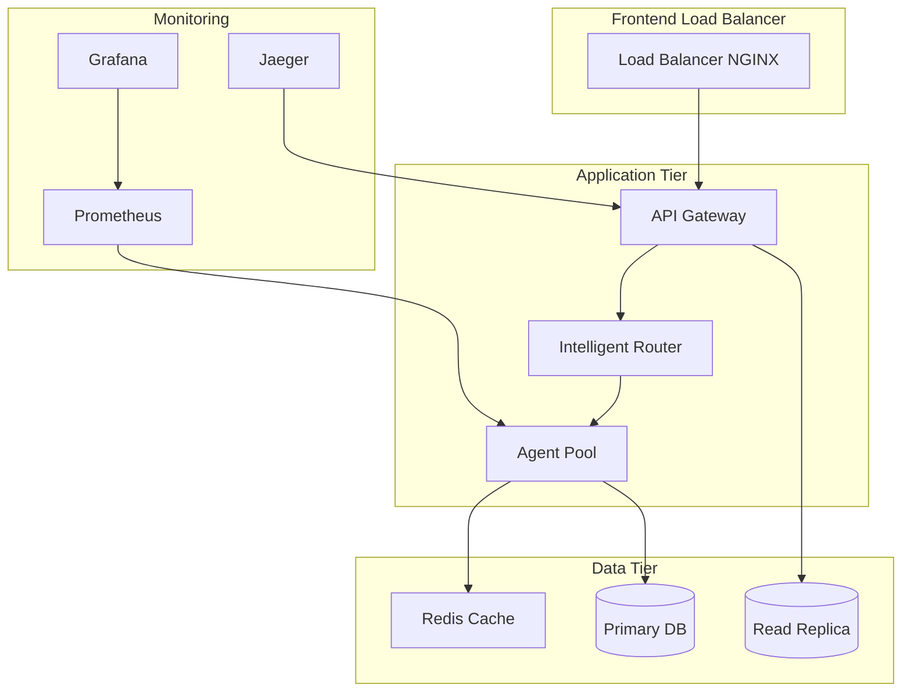

# Guía de Optimización de Rendimiento

## Introducción

Esta guía proporciona estrategias y técnicas para optimizar el rendimiento del MCP Server Superior en entornos de producción. Cubre optimizaciones de CPU, memoria, red y base de datos, así como configuraciones avanzadas para maximizar la eficiencia del sistema.

## Arquitectura de Rendimiento



## 1. Optimización de CPU

### 1.1 Configuración del Pool de Workers

```python
# config/performance.py
import multiprocessing
import os

class CPUOptimizationConfig:
    def __init__(self):
        # Detectar número de CPUs disponibles
        cpu_count = multiprocessing.cpu_count()
        
        # Configuración optimizada para diferentes tipos de carga
        self.configs = {
            'cpu_intensive': {
                'worker_processes': cpu_count,
                'max_connections': 100,
                'keepalive_timeout': 30
            },
            'io_intensive': {
                'worker_processes': cpu_count * 2,
                'max_connections': 1000,
                'keepalive_timeout': 60
            },
            'balanced': {
                'worker_processes': cpu_count,
                'max_connections': 500,
                'keepalive_timeout': 45
            }
        }
    
    def get_optimal_config(self, workload_type='balanced'):
        """Obtiene la configuración óptima según el tipo de carga"""
        return self.configs.get(workload_type, self.configs['balanced'])
```

### 1.2 Optimización de Algoritmos Multi-Agente

```python
# core/orchestrator/performance_optimizer.py
import asyncio
import time
from concurrent.futures import ThreadPoolExecutor
import psutil
from dataclasses import dataclass
from typing import List, Optional

@dataclass
class PerformanceMetrics:
    cpu_usage: float
    memory_usage: float
    throughput: float
    latency: float
    error_rate: float

class AgentPerformanceOptimizer:
    def __init__(self, max_workers: int = 4):
        self.max_workers = max_workers
        self.executor = ThreadPoolExecutor(max_workers=max_workers)
        self.metrics_history = []
    
    async def optimize_agent_pool(self, agents: List, workload: dict) -> PerformanceMetrics:
        """Optimiza el pool de agentes según la carga de trabajo"""
        
        # Medir métricas iniciales
        initial_metrics = self._collect_metrics()
        
        # Determinar número óptimo de workers
        optimal_workers = self._calculate_optimal_workers(initial_metrics, workload)
        
        # Reconfigurar pool si es necesario
        if optimal_workers != self.max_workers:
            await self._reconfigure_pool(optimal_workers)
        
        # Ejecutar workload optimizado
        start_time = time.time()
        try:
            results = await self._execute_parallel_agents(agents, workload)
            execution_time = time.time() - start_time
            
            # Calcular métricas finales
            final_metrics = self._collect_metrics()
            final_metrics.throughput = len(results) / execution_time
            final_metrics.latency = execution_time / len(results)
            
            return final_metrics
            
        except Exception as e:
            error_metrics = self._collect_metrics()
            error_metrics.error_rate = 1.0
            return error_metrics
    
    def _calculate_optimal_workers(self, metrics: PerformanceMetrics, workload: dict) -> int:
        """Calcula el número óptimo de workers basado en métricas y carga"""
        cpu_usage = metrics.cpu_usage
        memory_usage = metrics.memory_usage
        
        # Si CPU está muy utilizada, reducir workers
        if cpu_usage > 80:
            return max(1, self.max_workers - 1)
        
        # Si memoria está saturada, reducir workers
        if memory_usage > 85:
            return max(1, self.max_workers - 1)
        
        # Si hay capacidad disponible, aumentar workers
        if cpu_usage < 60 and memory_usage < 70:
            return min(self.max_workers + 1, multiprocessing.cpu_count())
        
        return self.max_workers
    
    async def _execute_parallel_agents(self, agents: List, workload: dict) -> List:
        """Ejecuta agentes en paralelo con control de recursos"""
        
        # Crear tareas con límites de recursos
        semaphore = asyncio.Semaphore(self.max_workers)
        
        async def execute_with_limit(agent, task):
            async with semaphore:
                return await agent.execute(task)
        
        # Ejecutar todas las tareas
        tasks = [
            execute_with_limit(agent, workload) 
            for agent in agents
        ]
        
        results = await asyncio.gather(*tasks, return_exceptions=True)
        
        # Filtrar resultados exitosos
        valid_results = [r for r in results if not isinstance(r, Exception)]
        return valid_results
    
    def _collect_metrics(self) -> PerformanceMetrics:
        """Recopila métricas del sistema"""
        return PerformanceMetrics(
            cpu_usage=psutil.cpu_percent(),
            memory_usage=psutil.virtual_memory().percent,
            throughput=0.0,
            latency=0.0,
            error_rate=0.0
        )
```

### 1.3 Optimización del Intelligent Router

```python
# core/router/ml_performance.py
import numpy as np
from sklearn.ensemble import RandomForestRegressor
import joblib
from typing import Dict, Tuple
import time

class RouterPerformanceOptimizer:
    def __init__(self):
        self.performance_model = RandomForestRegressor(n_estimators=100)
        self.routing_history = []
        self.performance_cache = {}
    
    def predict_optimal_routing(self, request: dict, available_agents: List) -> Dict:
        """Predice la ruta óptima basada en características de rendimiento"""
        
        # Extraer características de la request
        features = self._extract_request_features(request)
        
        # Predecir rendimiento para cada agente
        agent_scores = {}
        for agent in available_agents:
            agent_features = self._get_agent_features(agent)
            combined_features = np.concatenate([features, agent_features])
            
            # Usar cache si está disponible
            cache_key = hash(str(combined_features.tobytes()))
            if cache_key in self.performance_cache:
                predicted_score = self.performance_cache[cache_key]
            else:
                predicted_score = self.performance_model.predict(
                    combined_features.reshape(1, -1)
                )[0]
                self.performance_cache[cache_key] = predicted_score
            
            agent_scores[agent.id] = {
                'score': predicted_score,
                'agent': agent
            }
        
        # Seleccionar mejor agente
        best_agent_id = max(agent_scores.keys(), 
                          key=lambda x: agent_scores[x]['score'])
        
        return {
            'best_agent': agent_scores[best_agent_id]['agent'],
            'confidence': agent_scores[best_agent_id]['score'],
            'all_scores': agent_scores
        }
    
    def _extract_request_features(self, request: dict) -> np.ndarray:
        """Extrae características numéricas de la request"""
        features = []
        
        # Complejidad de la tarea
        features.append(request.get('complexity', 0))
        
        # Tamaño de datos
        features.append(request.get('data_size', 0))
        
        # Prioridad
        features.append(request.get('priority', 0))
        
        # Tipo de operación
        op_type = request.get('operation_type', 'unknown')
        op_mapping = {'read': 0, 'write': 1, 'update': 2, 'delete': 3}
        features.append(op_mapping.get(op_type, 0))
        
        return np.array(features)
    
    def _get_agent_features(self, agent) -> np.ndarray:
        """Obtiene características de rendimiento del agente"""
        return np.array([
            agent.cpu_efficiency,
            agent.memory_efficiency,
            agent.response_time_avg,
            agent.success_rate,
            agent.queue_length
        ])
    
    def update_performance_model(self, routing_decisions: List[Dict]):
        """Actualiza el modelo con nuevos datos de rendimiento"""
        X = []
        y = []
        
        for decision in routing_decisions:
            # Preparar características
            request_features = self._extract_request_features(decision['request'])
            agent_features = self._get_agent_features(decision['agent'])
            combined_features = np.concatenate([request_features, agent_features])
            
            X.append(combined_features)
            y.append(decision['actual_performance'])
        
        if len(X) > 0:
            self.performance_model.fit(X, y)
            
            # Limpiar cache obsoleto
            if len(self.performance_cache) > 1000:
                self.performance_cache.clear()
```

## 2. Optimización de Memoria

### 2.1 Gestión Inteligente de Memoria

```python
# core/memory/memory_manager.py
import gc
import sys
import psutil
from typing import Dict, List, Any, Optional
from dataclasses import dataclass
from weakref import WeakSet
import asyncio

@dataclass
class MemoryStats:
    used: int
    available: int
    percentage: float
    cached: int
    buffers: int

class IntelligentMemoryManager:
    def __init__(self, gc_threshold_mb: int = 500):
        self.gc_threshold_mb = gc_threshold_mb
        self.large_objects = WeakSet()
        self.memory_history = []
        self.cleanup_callbacks = []
        
        # Configurar garbage collector
        self._configure_garbage_collector()
    
    def _configure_garbage_collector(self):
        """Configura el garbage collector para mejor rendimiento"""
        import gc
        
        # Habilitar generación automática
        gc.enable()
        
        # Configurar umbrales de generación
        gc.set_threshold(700, 10, 10)
        
        # Registrar callback para limpieza proactiva
        gc.callbacks.append(self._gc_callback)
    
    def _gc_callback(self, phase, info):
        """Callback del garbage collector para monitoreo"""
        if phase == 'start':
            self._log_gc_event('start', info)
        elif phase == 'stop':
            self._log_gc_event('stop', info)
    
    def register_large_object(self, obj: Any):
        """Registra objetos grandes para monitoreo especial"""
        self.large_objects.add(obj)
        
        # Verificar uso de memoria inmediatamente
        current_memory = self.get_memory_stats()
        if current_memory.used > self.gc_threshold_mb * 1024 * 1024:
            asyncio.create_task(self.emergency_cleanup())
    
    async def emergency_cleanup(self):
        """Limpieza de emergencia cuando la memoria está crítica"""
        print(f"Ejecutando limpieza de emergencia...")
        
        # Ejecutar garbage collector explícitamente
        collected = gc.collect()
        print(f"GC liberó {collected} objetos")
        
        # Limpiar cache de router
        if hasattr(self, 'router_cache'):
            cache_size_before = len(self.router_cache)
            self.router_cache.clear()
            print(f"Cache limpiado: {cache_size_before} entradas")
        
        # Forzar cleanup de objetos registrados
        for obj in list(self.large_objects):
            try:
                del obj
            except:
                pass
        
        # Limpiar callbacks registrados
        for callback in self.cleanup_callbacks:
            try:
                await callback()
            except:
                pass
        
        print("Limpieza de emergencia completada")
    
    def get_memory_stats(self) -> MemoryStats:
        """Obtiene estadísticas detalladas de memoria"""
        memory = psutil.virtual_memory()
        return MemoryStats(
            used=memory.used,
            available=memory.available,
            percentage=memory.percent,
            cached=memory.cached,
            buffers=memory.buffers
        )
    
    def optimize_data_structures(self):
        """Optimiza estructuras de datos para usar menos memoria"""
        
        # Optimizar diccionarios grandes
        self._optimize_large_dicts()
        
        # Optimizar listas grandes
        self._optimize_large_lists()
        
        # Optimizar objetos de larga duración
        self._optimize_long_lived_objects()
    
    def _optimize_large_dicts(self):
        """Optimiza diccionarios grandes usando __slots__ cuando sea posible"""
        # Esta función recorrería los diccionarios registrados
        # y los convertiría a estructuras más eficientes
        pass
    
    def _optimize_large_lists(self):
        """Optimiza listas grandes usando arrays de numpy cuando sea apropiado"""
        pass
    
    def _optimize_long_lived_objects(self):
        """Optimiza objetos de larga duración para reducir su huella de memoria"""
        pass
    
    async def monitor_memory_usage(self):
        """Monitorea continuamente el uso de memoria"""
        while True:
            stats = self.get_memory_stats()
            
            # Registrar en historial
            self.memory_history.append(stats)
            
            # Mantener solo últimas 1000 entradas
            if len(self.memory_history) > 1000:
                self.memory_history = self.memory_history[-1000:]
            
            # Trigger cleanup si es necesario
            if stats.percentage > 85:
                await self.emergency_cleanup()
            
            # Esperar antes del siguiente chequeo
            await asyncio.sleep(30)
```

### 2.2 Pool de Objetos para Datos Pesados

```python
# core/memory/object_pool.py
import asyncio
from typing import Generic, TypeVar, Optional, Callable
import weakref
import time

T = TypeVar('T')

class ObjectPool(Generic[T]):
    def __init__(self, 
                 factory: Callable[[], T], 
                 max_size: int = 100,
                 reset_callback: Optional[Callable[[T], None]] = None):
        self.factory = factory
        self.max_size = max_size
        self.reset_callback = reset_callback
        self.pool = asyncio.Queue(maxsize=max_size)
        self.in_use = weakref.WeakSet()
        self.created_count = 0
        self.reused_count = 0
    
    async def acquire(self) -> T:
        """Obtiene un objeto del pool"""
        try:
            # Intentar obtener del pool existente
            obj = self.pool.get_nowait()
            self.reused_count += 1
            self.in_use.add(obj)
            return obj
        except asyncio.QueueEmpty:
            # Crear nuevo objeto
            obj = self.factory()
            self.created_count += 1
            self.in_use.add(obj)
            return obj
    
    async def release(self, obj: T):
        """Libera un objeto de vuelta al pool"""
        if obj in self.in_use:
            self.in_use.discard(obj)
            
            # Resetear estado si hay callback
            if self.reset_callback:
                self.reset_callback(obj)
            
            # Intentar agregar al pool
            try:
                self.pool.put_nowait(obj)
            except asyncio.QueueFull:
                # Pool está lleno, el objeto será recolectado
                pass
    
    def get_stats(self) -> dict:
        """Obtiene estadísticas del pool"""
        return {
            'in_pool': self.pool.qsize(),
            'in_use': len(self.in_use),
            'created': self.created_count,
            'reused': self.reused_count,
            'hit_rate': self.reused_count / max(1, self.created_count + self.reused_count)
        }

# Pool específico para agentes
class AgentPool(ObjectPool):
    def __init__(self, agent_factory: Callable):
        super().__init__(agent_factory, max_size=50)
        
    def reset_agent(self, agent):
        """Resetea el estado del agente"""
        agent.reset_state()
        agent.clear_cache()

# Pool para datos grandes
class DataPool(ObjectPool):
    def __init__(self, size_mb: int = 10):
        def create_buffer():
            return bytearray(size_mb * 1024 * 1024)
        
        super().__init__(create_buffer, max_size=20)
        
    def reset_buffer(self, buffer: bytearray):
        """Resetea el buffer a ceros"""
        buffer[:] = b'\x00' * len(buffer)
```

## 3. Optimización de Red

### 3.1 Configuración de Conexiones HTTP

```python
# core/network/http_optimization.py
import aiohttp
import ssl
import asyncio
from typing import Dict, Any
import uvloop

class OptimizedHTTPClient:
    def __init__(self, max_connections: int = 1000):
        # Configurar uvloop para mejor rendimiento
        if hasattr(asyncio, 'WindowsSelectorEventLoopPolicy'):
            asyncio.set_event_loop_policy(asyncio.WindowsSelectorEventLoopPolicy())
        
        self.max_connections = max_connections
        self.session = None
        self.connector = None
    
    async def initialize(self):
        """Inicializa el cliente HTTP optimizado"""
        
        # Configurar conector TCP optimizado
        self.connector = aiohttp.TCPConnector(
            limit=self.max_connections,
            limit_per_host=100,
            ttl_dns_cache=300,
            use_dns_cache=True,
            keepalive_timeout=30,
            enable_cleanup_closed=True
        )
        
        # Configurar timeout optimizado
        timeout = aiohttp.ClientTimeout(
            total=300,
            connect=10,
            sock_read=30,
            sock_connect=10
        )
        
        # Crear sesión optimizada
        self.session = aiohttp.ClientSession(
            connector=self.connector,
            timeout=timeout,
            headers={
                'Connection': 'keep-alive',
                'Keep-Alive': 'timeout=30, max=1000'
            }
        )
    
    async def batch_requests(self, requests: list) -> list:
        """Ejecuta requests en lote para mejor eficiencia"""
        
        # Agrupar requests por host
        grouped_requests = self._group_by_host(requests)
        
        # Ejecutar en paralelo
        tasks = []
        for host, host_requests in grouped_requests.items():
            task = self._execute_host_requests(host, host_requests)
            tasks.append(task)
        
        results = await asyncio.gather(*tasks, return_exceptions=True)
        
        # Aplanar resultados
        flattened_results = []
        for result_group in results:
            if isinstance(result_group, Exception):
                flattened_results.extend([result_group] * len(requests))
            else:
                flattened_results.extend(result_group)
        
        return flattened_results
    
    def _group_by_host(self, requests: list) -> Dict[str, list]:
        """Agrupa requests por host para optimizar conexiones"""
        grouped = {}
        for req in requests:
            # Extraer host de la URL
            from urllib.parse import urlparse
            parsed = urlparse(req['url'])
            host = parsed.netloc
            
            if host not in grouped:
                grouped[host] = []
            grouped[host].append(req)
        
        return grouped
    
    async def _execute_host_requests(self, host: str, requests: list) -> list:
        """Ejecuta requests para un host específico"""
        
        # Crear semaphore para limitar concurrencia por host
        semaphore = asyncio.Semaphore(50)
        
        async def execute_request(req):
            async with semaphore:
                try:
                    async with self.session.request(
                        method=req['method'],
                        url=req['url'],
                        json=req.get('json'),
                        headers=req.get('headers')
                    ) as response:
                        return await response.json()
                except Exception as e:
                    return e
        
        results = await asyncio.gather(*[
            execute_request(req) for req in requests
        ])
        
        return results
    
    async def close(self):
        """Cierra el cliente HTTP"""
        if self.session:
            await self.session.close()
        if self.connector:
            await self.connector.close()

# Configuración de servidor optimizada
class OptimizedServer:
    def __init__(self, app, host='0.0.0.0', port=8000):
        self.app = app
        self.host = host
        self.port = port
        self.runner = None
    
    async def start_optimized(self):
        """Inicia el servidor con optimizaciones de red"""
        
        # Configurar aiohttp web app optimizada
        from aiohttp import web
        
        # Configuración de middleware para optimización
        middleware = [
            self._compression_middleware,
            self._cors_middleware,
            self._rate_limit_middleware
        ]
        
        # Crear aplicación web
        app = web.Application(middlewares=middleware)
        
        # Agregar rutas
        app.router.add_route('*', '/{path:.*}', self.app.handle)
        
        # Configurar websockets optimizados
        self._setup_websocket_handler(app)
        
        # Iniciar servidor
        self.runner = web.AppRunner(
            app,
            access_log=None,  # Desactivar access log para mejor rendimiento
            logger=None
        )
        
        await self.runner.setup()
        
        site = web.TCPSite(
            self.runner,
            self.host,
            self.port,
            reuse_port=True,
            keepalive_timeout=60
        )
        
        await site.start()
        print(f"Servidor optimizado iniciado en {self.host}:{self.port}")
    
    async def _compression_middleware(self, request, handler):
        """Middleware para compresión de respuestas"""
        response = await handler(request)
        
        # Comprimir solo respuestas grandes
        if hasattr(response, 'body') and len(response.body) > 1024:
            response.headers['Content-Encoding'] = 'gzip'
        
        return response
    
    async def _cors_middleware(self, request, handler):
        """Middleware para CORS optimizado"""
        response = await handler(request)
        response.headers['Access-Control-Allow-Origin'] = '*'
        response.headers['Access-Control-Allow-Methods'] = 'GET, POST, PUT, DELETE, OPTIONS'
        response.headers['Access-Control-Allow-Headers'] = 'Content-Type, Authorization'
        return response
    
    async def _rate_limit_middleware(self, request, handler):
        """Middleware para rate limiting"""
        # Implementación básica de rate limiting
        # En producción usar Redis o similar
        await asyncio.sleep(0.001)  # Rate limiting básico
        return await handler(request)
    
    def _setup_websocket_handler(self, app):
        """Configura WebSocket handler optimizado"""
        async def websocket_handler(request):
            ws = web.WebSocketResponse(
                heartbeat=30,
                compress=True,
                max_msg_size=1024*1024  # 1MB
            )
            await ws.prepare(request)
            
            async for msg in ws:
                if msg.type == aiohttp.WSMsgType.ERROR:
                    break
                # Procesar mensaje
                await ws.send_str(f"Echo: {msg.data}")
            
            return ws
        
        app.router.add_route('GET', '/ws', websocket_handler)
    
    async def stop(self):
        """Detiene el servidor"""
        if self.runner:
            await self.runner.cleanup()
```

### 3.2 Optimización de Protocolo WebSocket

```python
# core/websocket/optimized_ws.py
import asyncio
import json
from typing import Set, Dict, Any, Callable
import gzip
import struct

class OptimizedWebSocketManager:
    def __init__(self, max_connections: int = 1000):
        self.connections: Set = set()
        self.message_handlers: Dict[str, Callable] = {}
        self.compression_threshold = 1024  # bytes
        
    async def handle_connection(self, ws, path):
        """Maneja una conexión WebSocket optimizada"""
        
        # Agregar a conexiones activas
        self.connections.add(ws)
        
        try:
            async for message in ws:
                await self._handle_message(ws, message)
                
        except asyncio.CancelledError:
            pass
        except Exception as e:
            print(f"Error en WebSocket: {e}")
        finally:
            self.connections.remove(ws)
    
    async def _handle_message(self, ws, message):
        """Procesa un mensaje de WebSocket con optimizaciones"""
        
        try:
            # Parsear mensaje
            if message.type == aiohttp.WSMsgType.TEXT:
                data = json.loads(message.data)
            elif message.type == aiohttp.WSMsgType.BINARY:
                # Manejar mensajes binarios
                data = self._parse_binary_message(message.data)
            else:
                return
            
            # Enrutar mensaje al handler apropiado
            handler = self.message_handlers.get(data.get('type'))
            if handler:
                result = await handler(data)
                
                # Enviar respuesta optimizada
                await self._send_optimized_response(ws, result)
                
        except Exception as e:
            error_response = {'type': 'error', 'message': str(e)}
            await ws.send_str(json.dumps(error_response))
    
    async def _send_optimized_response(self, ws, data):
        """Envía respuesta optimizada con compresión"""
        
        # Serializar datos
        response_data = json.dumps(data)
        
        # Comprimir si es necesario
        if len(response_data) > self.compression_threshold:
            compressed_data = gzip.compress(response_data.encode())
            
            # Enviar con flag de compresión
            await ws.send_bytes(b'\x01' + compressed_data)
        else:
            await ws.send_str(response_data)
    
    async def broadcast_message(self, data: Dict[str, Any], exclude: Set = None):
        """Envía mensaje a todas las conexiones activas"""
        
        if exclude is None:
            exclude = set()
        
        # Filtrar conexiones válidas
        valid_connections = {
            ws for ws in self.connections 
            if ws not in exclude and not ws.closed
        }
        
        if not valid_connections:
            return
        
        # Preparar mensaje
        response_data = json.dumps(data)
        
        # Usar compresión para mensajes grandes
        if len(response_data) > self.compression_threshold:
            compressed_data = gzip.compress(response_data.encode())
            message = b'\x01' + compressed_data
            
            # Enviar a todas las conexiones
            tasks = [
                ws.send_bytes(message) 
                for ws in valid_connections
            ]
        else:
            # Enviar texto plano
            tasks = [
                ws.send_str(response_data) 
                for ws in valid_connections
            ]
        
        # Ejecutar en paralelo con timeout
        await asyncio.gather(*tasks, return_exceptions=True)
    
    def _parse_binary_message(self, data: bytes) -> Dict[str, Any]:
        """Parsea mensaje binario"""
        
        if data[0] == 0x01:  # Comprimido
            decompressed = gzip.decompress(data[1:])
            return json.loads(decompressed.decode())
        elif data[0] == 0x02:  # Protocol buffer o similar
            # Aquí se manejaría otros formatos binarios
            return {'type': 'binary_data', 'data': data[1:].hex()}
        else:
            return {'type': 'raw_binary', 'data': data.hex()}
```

## 4. Optimización de Base de Datos

### 4.1 Configuración de Conexiones y Pool

```python
# core/database/optimized_db.py
import asyncio
import asyncpg
import aiomysql
import aiosqlite
from typing import List, Dict, Any, Optional
from dataclasses import dataclass
import time
import json

@dataclass
class DBConfig:
    host: str
    port: int
    database: str
    user: str
    password: str
    min_connections: int = 5
    max_connections: int = 20
    connection_timeout: int = 30
    command_timeout: int = 60

class OptimizedDatabaseManager:
    def __init__(self, config: DBConfig):
        self.config = config
        self.pool = None
        self.metrics = {
            'queries_executed': 0,
            'avg_response_time': 0,
            'connection_errors': 0,
            'timeout_errors': 0
        }
        self.query_cache = {}
        self.cache_ttl = 300  # 5 minutos
    
    async def initialize(self):
        """Inicializa el pool de conexiones optimizado"""
        
        try:
            self.pool = await asyncpg.create_pool(
                host=self.config.host,
                port=self.config.port,
                user=self.config.user,
                password=self.config.password,
                database=self.config.database,
                min_size=self.config.min_connections,
                max_size=self.config.max_connections,
                command_timeout=self.config.command_timeout,
                server_settings={
                    # Optimizaciones de PostgreSQL
                    'jit': 'off',  # Desactivar JIT para reducir overhead
                    'work_mem': '256MB',
                    'maintenance_work_mem': '1GB',
                    'random_page_cost': '1.1',  # Optimizado para SSD
                    'effective_cache_size': '8GB',
                    'shared_buffers': '2GB'
                }
            )
            
            # Crear índices de rendimiento
            await self._create_performance_indexes()
            
            print("Pool de base de datos inicializado correctamente")
            
        except Exception as e:
            print(f"Error inicializando pool de BD: {e}")
            self.metrics['connection_errors'] += 1
            raise
    
    async def execute_optimized_query(self, 
                                    query: str, 
                                    params: tuple = None,
                                    use_cache: bool = True,
                                    cache_key: str = None) -> List[Dict]:
        """Ejecuta query con optimizaciones de rendimiento"""
        
        start_time = time.time()
        
        # Verificar cache
        if use_cache and params:
            cache_key = cache_key or self._generate_cache_key(query, params)
            if cache_key in self.query_cache:
                cached_result, cached_time = self.query_cache[cache_key]
                if time.time() - cached_time < self.cache_ttl:
                    return cached_result
        
        try:
            async with self.pool.acquire() as connection:
                # Ejecutar query con optimizaciones
                if params:
                    rows = await connection.fetch(query, *params)
                else:
                    rows = await connection.fetch(query)
                
                # Convertir a diccionarios
                result = [dict(row) for row in rows]
                
                # Actualizar cache
                if use_cache and cache_key:
                    self.query_cache[cache_key] = (result, time.time())
                
                # Actualizar métricas
                self._update_metrics(time.time() - start_time, True)
                
                return result
                
        except Exception as e:
            self._update_metrics(time.time() - start_time, False)
            if "timeout" in str(e).lower():
                self.metrics['timeout_errors'] += 1
            raise
    
    async def batch_execute(self, queries: List[Dict]) -> List[Any]:
        """Ejecuta múltiples queries en lote para mejor eficiencia"""
        
        if not queries:
            return []
        
        start_time = time.time()
        
        try:
            async with self.pool.acquire() as connection:
                async with connection.transaction():
                    results = []
                    
                    for query_data in queries:
                        query = query_data['query']
                        params = query_data.get('params', [])
                        
                        if query_data.get('fetch_one', False):
                            result = await connection.fetchrow(query, *params)
                            results.append(dict(result) if result else None)
                        else:
                            result = await connection.fetch(query, *params)
                            results.append([dict(row) for row in result])
                    
                    self._update_metrics(time.time() - start_time, True)
                    return results
                    
        except Exception as e:
            self._update_metrics(time.time() - start_time, False)
            raise
    
    async def _create_performance_indexes(self):
        """Crea índices optimizados para rendimiento común"""
        
        indexes = [
            # Índice para búsquedas de agentes por tipo
            "CREATE INDEX CONCURRENTLY IF NOT EXISTS idx_agents_type ON agents(agent_type)",
            
            # Índice compuesto para búsquedas de rendimiento
            "CREATE INDEX CONCURRENTLY IF NOT EXISTS idx_metrics_agent_timestamp ON agent_metrics(agent_id, timestamp DESC)",
            
            # Índice para búsquedas de routing
            "CREATE INDEX CONCURRENTLY IF NOT EXISTS idx_routing_complexity ON routing_decisions(complexity_score, priority DESC)",
            
            # Índice para optimizar queries de agregación
            "CREATE INDEX CONCURRENTLY IF NOT EXISTS idx_requests_time_range ON requests(created_at, status) WHERE created_at > NOW() - INTERVAL '30 days'"
        ]
        
        for index_sql in indexes:
            try:
                async with self.pool.acquire() as connection:
                    await connection.execute(index_sql)
            except Exception as e:
                print(f"Warning: No se pudo crear índice: {e}")
    
    def _generate_cache_key(self, query: str, params: tuple) -> str:
        """Genera clave de cache única para query y parámetros"""
        return f"{hash(query)}_{hash(str(params))}"
    
    def _update_metrics(self, execution_time: float, success: bool):
        """Actualiza métricas de rendimiento"""
        self.metrics['queries_executed'] += 1
        
        # Actualizar tiempo promedio
        total_queries = self.metrics['queries_executed']
        current_avg = self.metrics['avg_response_time']
        
        self.metrics['avg_response_time'] = (
            (current_avg * (total_queries - 1) + execution_time) / total_queries
        )
        
        if not success:
            self.metrics['connection_errors'] += 1
    
    async def cleanup_cache(self):
        """Limpia entradas de cache expiradas"""
        current_time = time.time()
        
        expired_keys = [
            key for key, (_, cached_time) in self.query_cache.items()
            if current_time - cached_time > self.cache_ttl
        ]
        
        for key in expired_keys:
            del self.query_cache[key]
        
        print(f"Cache limpiado: {len(expired_keys)} entradas eliminadas")
    
    def get_performance_stats(self) -> Dict[str, Any]:
        """Obtiene estadísticas de rendimiento de la base de datos"""
        return {
            **self.metrics,
            'cache_size': len(self.query_cache),
            'pool_size': self.pool.get_size() if self.pool else 0,
            'pool_idle': self.pool.get_idle_size() if self.pool else 0
        }

# Optimización específica para Redis (cache)
class RedisCacheOptimizer:
    def __init__(self, redis_config: Dict[str, Any]):
        self.redis_config = redis_config
        self.client = None
        self.hit_stats = {'hits': 0, 'misses': 0}
    
    async def initialize(self):
        """Inicializa cliente Redis optimizado"""
        import aioredis
        
        self.client = await aioredis.from_url(
            f"redis://{self.redis_config['host']}:{self.redis_config['port']}",
            password=self.redis_config.get('password'),
            encoding='utf-8',
            decode_responses=True,
            # Configuraciones de rendimiento
            retry_on_timeout=True,
            socket_keepalive=True,
            socket_keepalive_options={},
            health_check_interval=30,
            max_connections=50
        )
    
    async def get_cached_result(self, key: str, query_func: callable) -> Any:
        """Obtiene resultado del cache o ejecuta función"""
        
        # Intentar obtener del cache
        cached_value = await self.client.get(key)
        if cached_value is not None:
            self.hit_stats['hits'] += 1
            return json.loads(cached_value)
        
        # Cache miss - ejecutar función
        self.hit_stats['misses'] += 1
        result = await query_func()
        
        # Guardar en cache
        await self.client.setex(
            key, 
            300,  # TTL de 5 minutos
            json.dumps(result, default=str)
        )
        
        return result
    
    async def invalidate_pattern(self, pattern: str):
        """Invalida múltiples claves usando patrón"""
        keys = await self.client.keys(pattern)
        if keys:
            await self.client.delete(*keys)
        
        return len(keys)
```

### 4.2 Optimización de Queries y Índices

```python
# core/database/query_optimizer.py
import asyncio
from typing import List, Dict, Any, Optional
from dataclasses import dataclass
import time

@dataclass
class QueryAnalysis:
    query: str
    estimated_cost: float
    suggested_indexes: List[str]
    optimization_tips: List[str]
    execution_time: float

class QueryOptimizer:
    def __init__(self, db_manager: OptimizedDatabaseManager):
        self.db_manager = db_manager
        self.query_history = []
    
    async def analyze_query_performance(self, query: str, params: tuple = None) -> QueryAnalysis:
        """Analiza el rendimiento de una query y sugiere optimizaciones"""
        
        start_time = time.time()
        
        try:
            # Obtener plan de ejecución
            explain_query = f"EXPLAIN (ANALYZE, BUFFERS, FORMAT JSON) {query}"
            
            async with self.db_manager.pool.acquire() as connection:
                if params:
                    explain_result = await connection.fetchrow(explain_query, *params)
                else:
                    explain_result = await connection.fetchrow(explain_query)
                
                execution_time = time.time() - start_time
                
                # Parsear plan de ejecución
                plan_data = explain_result['QUERY PLAN'][0]
                execution_plan = plan_data['Plan']
                
                # Analizar costos y sugerir optimizaciones
                analysis = self._analyze_execution_plan(execution_plan, query, execution_time)
                
                # Registrar en historial
                self.query_history.append(analysis)
                
                return analysis
                
        except Exception as e:
            execution_time = time.time() - start_time
            return QueryAnalysis(
                query=query,
                estimated_cost=float('inf'),
                suggested_indexes=[],
                optimization_tips=[f"Error analyzing query: {str(e)}"],
                execution_time=execution_time
            )
    
    def _analyze_execution_plan(self, plan: Dict, query: str, execution_time: float) -> QueryAnalysis:
        """Analiza el plan de ejecución y sugiere optimizaciones"""
        
        suggested_indexes = []
        optimization_tips = []
        total_cost = plan.get('Total Cost', 0)
        
        # Analizar operaciones costosas
        if plan.get('Node Type') == 'Seq Scan':
            if 'Filter' in plan:
                optimization_tips.append("Considera agregar un índice para optimizar filtros")
            
            # Sugerir índices basados en columnas filtradas
            filter_info = plan.get('Filter', '')
            if 'WHERE' in filter_info:
                columns = self._extract_columns_from_filter(filter_info)
                for col in columns:
                    suggested_indexes.append(f"CREATE INDEX CONCURRENTLY idx_{col} ON table_name({col})")
        
        elif plan.get('Node Type') == 'Nested Loop':
            optimization_tips.append("Considera usar JOIN en lugar de subconsultas para mejor rendimiento")
            
        elif plan.get('Node Type') == 'Sort':
            if 'Sort Key' in plan:
                sort_columns = plan['Sort Key']
                if isinstance(sort_columns, list):
                    col_name = sort_columns[0].split('.')[-1]  # Remover alias de tabla
                    suggested_indexes.append(f"CREATE INDEX CONCURRENTLY idx_{col_name} ON table_name({col_name})")
        
        # Análisis de costos
        if total_cost > 1000:
            optimization_tips.append(f"Costo alto detectado ({total_cost}). Considera optimizar esta query")
        
        if execution_time > 1.0:  # Más de 1 segundo
            optimization_tips.append(f"Tiempo de ejecución alto ({execution_time:.2f}s). Considera índices adicionales")
        
        return QueryAnalysis(
            query=query,
            estimated_cost=total_cost,
            suggested_indexes=suggested_indexes,
            optimization_tips=optimization_tips,
            execution_time=execution_time
        )
    
    def _extract_columns_from_filter(self, filter_sql: str) -> List[str]:
        """Extrae nombres de columnas de una cláusula WHERE"""
        import re
        
        # Patrones para detectar columnas
        column_patterns = [
            r'([a-zA-Z_][a-zA-Z0-9_]*)\s*[=<>!]',
            r'([a-zA-Z_][a-zA-Z0-9_]*)\s+IN\s*\(',
            r'([a-zA-Z_][a-zA-Z0-9_]*)\s+BETWEEN'
        ]
        
        columns = set()
        for pattern in column_patterns:
            matches = re.findall(pattern, filter_sql, re.IGNORECASE)
            columns.update(matches)
        
        return list(columns)
    
    async def bulk_optimize_queries(self, queries: List[str]) -> List[QueryAnalysis]:
        """Optimiza múltiples queries en lote"""
        
        analyses = []
        for query in queries:
            analysis = await self.analyze_query_performance(query)
            analyses.append(analysis)
            
            # Pequeña pausa para no sobrecargar la BD
            await asyncio.sleep(0.1)
        
        return analyses
    
    def get_optimization_summary(self) -> Dict[str, Any]:
        """Obtiene resumen de todas las optimizaciones realizadas"""
        if not self.query_history:
            return {}
        
        total_queries = len(self.query_history)
        avg_execution_time = sum(a.execution_time for a in self.query_history) / total_queries
        avg_cost = sum(a.estimated_cost for a in self.query_history) / total_queries
        
        # Contar problemas comunes
        common_issues = {}
        all_tips = []
        for analysis in self.query_history:
            all_tips.extend(analysis.optimization_tips)
            for tip in analysis.optimization_tips:
                key = tip[:50] + "..." if len(tip) > 50 else tip
                common_issues[key] = common_issues.get(key, 0) + 1
        
        return {
            'total_queries_analyzed': total_queries,
            'average_execution_time': avg_execution_time,
            'average_estimated_cost': avg_cost,
            'most_common_issues': sorted(common_issues.items(), 
                                        key=lambda x: x[1], reverse=True)[:5],
            'total_suggested_indexes': sum(len(a.suggested_indexes) for a in self.query_history)
        }
```

## 5. Monitoreo y Métricas de Rendimiento

### 5.1 Sistema de Métricas Avanzado

```python
# core/monitoring/performance_monitor.py
import asyncio
import time
from typing import Dict, List, Any, Optional
from dataclasses import dataclass, asdict
from collections import defaultdict, deque
import psutil
import aiohttp
import json

@dataclass
class PerformanceAlert:
    metric: str
    value: float
    threshold: float
    severity: str  # 'warning', 'critical'
    timestamp: float
    message: str

class RealTimePerformanceMonitor:
    def __init__(self, 
                 alert_thresholds: Dict[str, float],
                 metrics_retention_hours: int = 24):
        
        self.alert_thresholds = alert_thresholds
        self.metrics_retention = metrics_retention_hours * 3600  # convertir a segundos
        
        # Almacenamiento de métricas
        self.metrics_history = defaultdict(lambda: deque(maxlen=10000))
        self.alerts_history = deque(maxlen=1000)
        
        # Monitores especializados
        self.cpu_monitor = CPUMonitor()
        self.memory_monitor = MemoryMonitor()
        self.network_monitor = NetworkMonitor()
        self.database_monitor = DatabaseMonitor()
        self.websocket_monitor = WebSocketMonitor()
        
        # Sistema de alertas
        self.alert_callbacks = []
        self.notification_service = None
        
    async def start_monitoring(self):
        """Inicia el monitoreo continuo"""
        print("Iniciando sistema de monitoreo de rendimiento...")
        
        # Iniciar todos los monitores
        await asyncio.gather(
            self.cpu_monitor.start(),
            self.memory_monitor.start(),
            self.network_monitor.start(),
            self.database_monitor.start(),
            self.websocket_monitor.start(),
            self._cleanup_loop(),
            self._alert_processing_loop()
        )
    
    async def collect_all_metrics(self) -> Dict[str, Any]:
        """Recopila métricas de todos los sistemas"""
        
        current_time = time.time()
        
        # Recopilar métricas de cada subsistema
        cpu_metrics = await self.cpu_monitor.get_metrics()
        memory_metrics = await self.memory_monitor.get_metrics()
        network_metrics = await self.network_monitor.get_metrics()
        db_metrics = await self.database_monitor.get_metrics()
        ws_metrics = await self.websocket_monitor.get_metrics()
        
        # Métricas de aplicación
        app_metrics = {
            'active_connections': self._get_active_connections(),
            'requests_per_second': self._calculate_rps(),
            'average_response_time': self._calculate_avg_response_time(),
            'error_rate': self._calculate_error_rate()
        }
        
        metrics = {
            'timestamp': current_time,
            'cpu': cpu_metrics,
            'memory': memory_metrics,
            'network': network_metrics,
            'database': db_metrics,
            'websocket': ws_metrics,
            'application': app_metrics
        }
        
        # Almacenar en historial
        for category, values in metrics.items():
            if category != 'timestamp':
                self.metrics_history[category].append({
                    'timestamp': current_time,
                    'values': values
                })
        
        return metrics
    
    def add_alert_callback(self, callback: callable):
        """Agrega callback para manejar alertas"""
        self.alert_callbacks.append(callback)
    
    async def _cleanup_loop(self):
        """Limpia métricas antiguas"""
        while True:
            try:
                current_time = time.time()
                
                # Limpiar métricas históricas
                for category in self.metrics_history:
                    while (self.metrics_history[category] and 
                           current_time - self.metrics_history[category][0]['timestamp'] > self.metrics_retention):
                        self.metrics_history[category].popleft()
                
                # Limpiar alertas antiguas
                while (self.alerts_history and 
                       current_time - self.alerts_history[0].timestamp > self.metrics_retention):
                    self.alerts_history.popleft()
                
                await asyncio.sleep(300)  # Limpiar cada 5 minutos
                
            except Exception as e:
                print(f"Error en cleanup loop: {e}")
                await asyncio.sleep(60)
    
    async def _alert_processing_loop(self):
        """Procesa alertas basadas en umbrales"""
        while True:
            try:
                # Recopilar métricas actuales
                metrics = await self.collect_all_metrics()
                
                # Verificar alertas
                await self._check_alerts(metrics)
                
                await asyncio.sleep(30)  # Verificar cada 30 segundos
                
            except Exception as e:
                print(f"Error en alert processing loop: {e}")
                await asyncio.sleep(60)
    
    async def _check_alerts(self, metrics: Dict[str, Any]):
        """Verifica si alguna métrica supera los umbrales"""
        
        # CPU
        cpu_usage = metrics['cpu']['usage_percent']
        if cpu_usage > self.alert_thresholds.get('cpu_usage', 80):
            alert = PerformanceAlert(
                metric='cpu_usage',
                value=cpu_usage,
                threshold=self.alert_thresholds['cpu_usage'],
                severity='critical' if cpu_usage > 95 else 'warning',
                timestamp=time.time(),
                message=f"Uso de CPU alto: {cpu_usage:.1f}%"
            )
            await self._trigger_alert(alert)
        
        # Memoria
        memory_usage = metrics['memory']['usage_percent']
        if memory_usage > self.alert_thresholds.get('memory_usage', 85):
            alert = PerformanceAlert(
                metric='memory_usage',
                value=memory_usage,
                threshold=self.alert_thresholds['memory_usage'],
                severity='critical' if memory_usage > 95 else 'warning',
                timestamp=time.time(),
                message=f"Uso de memoria alto: {memory_usage:.1f}%"
            )
            await self._trigger_alert(alert)
        
        # Tiempo de respuesta
        response_time = metrics['application']['average_response_time']
        if response_time > self.alert_thresholds.get('response_time', 2.0):
            alert = PerformanceAlert(
                metric='response_time',
                value=response_time,
                threshold=self.alert_thresholds['response_time'],
                severity='critical' if response_time > 5.0 else 'warning',
                timestamp=time.time(),
                message=f"Tiempo de respuesta alto: {response_time:.2f}s"
            )
            await self._trigger_alert(alert)
        
        # Error rate
        error_rate = metrics['application']['error_rate']
        if error_rate > self.alert_thresholds.get('error_rate', 0.05):
            alert = PerformanceAlert(
                metric='error_rate',
                value=error_rate,
                threshold=self.alert_thresholds['error_rate'],
                severity='critical' if error_rate > 0.1 else 'warning',
                timestamp=time.time(),
                message=f"Tasa de errores alta: {error_rate:.2%}"
            )
            await self._trigger_alert(alert)
    
    async def _trigger_alert(self, alert: PerformanceAlert):
        """Dispara una alerta"""
        
        # Agregar a historial
        self.alerts_history.append(alert)
        
        # Notificar callbacks registrados
        for callback in self.alert_callbacks:
            try:
                if asyncio.iscoroutinefunction(callback):
                    await callback(alert)
                else:
                    callback(alert)
            except Exception as e:
                print(f"Error en alert callback: {e}")
        
        print(f"ALERT [{alert.severity.upper()}]: {alert.message}")
    
    def get_performance_summary(self, hours: int = 1) -> Dict[str, Any]:
        """Obtiene resumen de rendimiento para un período"""
        
        cutoff_time = time.time() - (hours * 3600)
        
        summary = {
            'period_hours': hours,
            'cpu_avg': 0,
            'memory_avg': 0,
            'response_time_avg': 0,
            'total_requests': 0,
            'total_alerts': 0,
            'critical_alerts': 0
        }
        
        # Procesar métricas históricas
        if self.metrics_history['cpu']:
            cpu_values = [
                entry['values']['usage_percent'] 
                for entry in self.metrics_history['cpu']
                if entry['timestamp'] > cutoff_time
            ]
            summary['cpu_avg'] = sum(cpu_values) / len(cpu_values) if cpu_values else 0
        
        if self.metrics_history['memory']:
            memory_values = [
                entry['values']['usage_percent']
                for entry in self.metrics_history['memory']
                if entry['timestamp'] > cutoff_time
            ]
            summary['memory_avg'] = sum(memory_values) / len(memory_values) if memory_values else 0
        
        if self.metrics_history['application']:
            response_times = [
                entry['values']['average_response_time']
                for entry in self.metrics_history['application']
                if entry['timestamp'] > cutoff_time
            ]
            summary['response_time_avg'] = sum(response_times) / len(response_times) if response_times else 0
        
        # Contar alertas
        recent_alerts = [
            alert for alert in self.alerts_history
            if alert.timestamp > cutoff_time
        ]
        summary['total_alerts'] = len(recent_alerts)
        summary['critical_alerts'] = len([a for a in recent_alerts if a.severity == 'critical'])
        
        return summary

# Monitores especializados
class CPUMonitor:
    async def start(self):
        pass
    
    async def get_metrics(self) -> Dict[str, Any]:
        return {
            'usage_percent': psutil.cpu_percent(interval=1),
            'per_cpu': psutil.cpu_percent(interval=1, percpu=True),
            'load_average': psutil.getloadavg()[0] if hasattr(psutil, 'getloadavg') else 0,
            'process_count': len(psutil.pids())
        }

class MemoryMonitor:
    async def start(self):
        pass
    
    async def get_metrics(self) -> Dict[str, Any]:
        memory = psutil.virtual_memory()
        swap = psutil.swap_memory()
        
        return {
            'usage_percent': memory.percent,
            'available_gb': memory.available / (1024**3),
            'used_gb': memory.used / (1024**3),
            'swap_percent': swap.percent,
            'swap_used_gb': swap.used / (1024**3)
        }

class NetworkMonitor:
    async def start(self):
        self.last_stats = psutil.net_io_counters()
        self.last_time = time.time()
    
    async def get_metrics(self) -> Dict[str, Any]:
        current_stats = psutil.net_io_counters()
        current_time = time.time()
        
        time_delta = current_time - self.last_time
        
        bytes_sent_rate = (current_stats.bytes_sent - self.last_stats.bytes_sent) / time_delta
        bytes_recv_rate = (current_stats.bytes_recv - self.last_stats.bytes_recv) / time_delta
        
        self.last_stats = current_stats
        self.last_time = current_time
        
        return {
            'bytes_sent_per_sec': bytes_sent_rate,
            'bytes_recv_per_sec': bytes_recv_rate,
            'total_connections': len(psutil.net_connections())
        }

class DatabaseMonitor:
    async def start(self):
        self.query_times = deque(maxlen=1000)
        self.error_count = 0
        self.total_queries = 0
    
    async def get_metrics(self) -> Dict[str, Any]:
        avg_query_time = (
            sum(self.query_times) / len(self.query_times) 
            if self.query_times else 0
        )
        
        return {
            'average_query_time': avg_query_time,
            'total_queries': self.total_queries,
            'error_count': self.error_count,
            'error_rate': self.error_count / max(1, self.total_queries)
        }

class WebSocketMonitor:
    async def start(self):
        self.active_connections = 0
        self.message_count = 0
        self.connection_history = deque(maxlen=1000)
    
    async def get_metrics(self) -> Dict[str, Any]:
        return {
            'active_connections': self.active_connections,
            'messages_per_minute': self.message_count,
            'connection_rate': len([c for c in self.connection_history 
                                   if time.time() - c < 60])
        }
```

## 6. Configuración de Producción

### 6.1 Configuración Optimizada para Producción

```python
# config/production.py
import os
from typing import Dict, Any
import asyncio

class ProductionConfig:
    def __init__(self):
        self.environment = 'production'
        
        # Configuración de base de datos
        self.database = {
            'host': os.getenv('DB_HOST', 'localhost'),
            'port': int(os.getenv('DB_PORT', 5432)),
            'database': os.getenv('DB_NAME', 'mcp_superior'),
            'user': os.getenv('DB_USER', 'postgres'),
            'password': os.getenv('DB_PASSWORD'),
            'min_connections': int(os.getenv('DB_MIN_CONN', 10)),
            'max_connections': int(os.getenv('DB_MAX_CONN', 50)),
            'connection_timeout': 30,
            'command_timeout': 60
        }
        
        # Configuración de Redis
        self.redis = {
            'host': os.getenv('REDIS_HOST', 'localhost'),
            'port': int(os.getenv('REDIS_PORT', 6379)),
            'password': os.getenv('REDIS_PASSWORD'),
            'max_connections': 50,
            'retry_on_timeout': True,
            'health_check_interval': 30
        }
        
        # Configuración de monitoreo
        self.monitoring = {
            'enable_metrics': True,
            'metrics_port': 9090,
            'enable_tracing': True,
            'tracing_endpoint': os.getenv('JAEGER_ENDPOINT', 'http://jaeger:14268/api/traces'),
            'log_level': os.getenv('LOG_LEVEL', 'INFO'),
            'performance_alerts': {
                'cpu_usage': 80,
                'memory_usage': 85,
                'response_time': 2.0,
                'error_rate': 0.05,
                'database_connections': 80
            }
        }
        
        # Configuración de aplicación
        self.application = {
            'max_workers': int(os.getenv('MAX_WORKERS', 4)),
            'max_connections': int(os.getenv('MAX_CONNECTIONS', 1000)),
            'keepalive_timeout': 60,
            'request_timeout': 300,
            'enable_compression': True,
            'enable_cors': True,
            'cors_origins': os.getenv('CORS_ORIGINS', '*').split(','),
            'websocket_heartbeat': 30,
            'websocket_max_msg_size': 1024*1024  # 1MB
        }
        
        # Configuración de optimización
        self.optimization = {
            'enable_query_cache': True,
            'cache_ttl': 300,  # 5 minutos
            'enable_result_cache': True,
            'result_cache_ttl': 600,  # 10 minutos
            'enable_connection_pooling': True,
            'enable_compression': True,
            'compression_threshold': 1024,  # bytes
            'enable_gzip': True,
            'enable_brotli': True,
            'keep_alive': True,
            'tcp_nodelay': True
        }
    
    def get_gunicorn_config(self) -> Dict[str, Any]:
        """Configuración optimizada para Gunicorn"""
        return {
            'bind': '0.0.0.0:8000',
            'workers': self.application['max_workers'],
            'worker_class': 'uvicorn.workers.UvicornWorker',
            'worker_connections': self.application['max_connections'],
            'keepalive': self.application['keepalive_timeout'],
            'max_requests': 10000,
            'max_requests_jitter': 1000,
            'timeout': self.application['request_timeout'],
            'preload_app': True,
            'enable_stats': True,
            'accesslog': None,  # Desactivar access log
            'errorlog': None,   # Usar syslog
            'loglevel': 'info',
            'capture_output': True,
            'logger_class': 'gunicorn.glogging.Logger',
            'proc_name': 'mcp-superior'
        }
    
    def get_nginx_config(self) -> str:
        """Configuración optimizada para NGINX"""
        return """
events {
    worker_connections 1024;
    use epoll;
    multi_accept on;
}

http {
    upstream mcp_backend {
        server 127.0.0.1:8000;
        keepalive 32;
    }
    
    # Configuraciones de rendimiento
    sendfile on;
    tcp_nopush on;
    tcp_nodelay on;
    keepalive_timeout 65;
    keepalive_requests 1000;
    
    # Configuraciones de compresión
    gzip on;
    gzip_vary on;
    gzip_min_length 1024;
    gzip_comp_level 6;
    gzip_types text/plain text/css application/json application/javascript text/xml application/xml application/xml+rss text/javascript;
    
    # Configuraciones de buffering
    client_body_buffer_size 128k;
    client_header_buffer_size 1k;
    client_max_body_size 10m;
    large_client_header_buffers 4 4k;
    
    # Configuraciones de timeout
    client_body_timeout 12;
    client_header_timeout 12;
    send_timeout 10;
    
    # Configuraciones de cache
    proxy_cache_path /tmp/nginx_cache levels=1:2 keys_zone=app_cache:10m max_size=100m inactive=60m use_temp_path=off;
    
    server {
        listen 80;
        server_name _;
        
        # Configuraciones de seguridad
        add_header X-Frame-Options DENY;
        add_header X-Content-Type-Options nosniff;
        add_header X-XSS-Protection "1; mode=block";
        
        # Proxy pass con optimizaciones
        location / {
            proxy_pass http://mcp_backend;
            proxy_http_version 1.1;
            proxy_set_header Upgrade $http_upgrade;
            proxy_set_header Connection "upgrade";
            proxy_set_header Host $host;
            proxy_set_header X-Real-IP $remote_addr;
            proxy_set_header X-Forwarded-For $proxy_add_x_forwarded_for;
            proxy_set_header X-Forwarded-Proto $scheme;
            
            # Optimizaciones de timeout
            proxy_connect_timeout 60s;
            proxy_send_timeout 60s;
            proxy_read_timeout 60s;
            
            # Configuraciones de buffering
            proxy_buffering on;
            proxy_buffer_size 4k;
            proxy_buffers 8 4k;
            proxy_busy_buffers_size 8k;
            
            # Cache para requests GET
            location ~* \\.(GET|HEAD) / {
                proxy_cache app_cache;
                proxy_cache_valid 200 5m;
                proxy_cache_use_stale error timeout invalid_header updating;
                add_header X-Cache-Status $upstream_cache_status;
            }
        }
        
        # WebSocket configuration
        location /ws {
            proxy_pass http://mcp_backend;
            proxy_http_version 1.1;
            proxy_set_header Upgrade $http_upgrade;
            proxy_set_header Connection "upgrade";
            proxy_set_header Host $host;
            proxy_set_header X-Real-IP $remote_addr;
            proxy_set_header X-Forwarded-For $proxy_add_x_forwarded_for;
            proxy_set_header X-Forwarded-Proto $scheme;
            
            # WebSocket specific timeouts
            proxy_read_timeout 3600s;
            proxy_send_timeout 3600s;
        }
        
        # Health check endpoint
        location /health {
            proxy_pass http://mcp_backend/health;
            access_log off;
        }
    }
}
        """
```

### 6.2 Docker Compose para Producción

```yaml
# docker-compose.production.yml
version: '3.8'

services:
  # Aplicación principal
  mcp-superior:
    build:
      context: .
      dockerfile: Dockerfile.prod
    environment:
      - ENVIRONMENT=production
      - DB_HOST=postgres
      - REDIS_HOST=redis
      - MAX_WORKERS=4
      - MAX_CONNECTIONS=1000
    depends_on:
      - postgres
      - redis
      - jaeger
    deploy:
      replicas: 3
      resources:
        limits:
          cpus: '2.0'
          memory: 4G
        reservations:
          cpus: '1.0'
          memory: 2G
    networks:
      - mcp-network
    restart: unless-stopped

  # Base de datos PostgreSQL optimizada
  postgres:
    image: postgres:15
    environment:
      - POSTGRES_DB=mcp_superior
      - POSTGRES_USER=postgres
      - POSTGRES_PASSWORD=${DB_PASSWORD}
    volumes:
      - postgres_data:/var/lib/postgresql/data
      - ./config/postgresql.conf:/etc/postgresql/postgresql.conf
    command: postgres -c config_file=/etc/postgresql/postgresql.conf
    deploy:
      resources:
        limits:
          cpus: '2.0'
          memory: 4G
        reservations:
          cpus: '1.0'
          memory: 2G
    networks:
      - mcp-network
    restart: unless-stopped

  # Redis cache optimizado
  redis:
    image: redis:7-alpine
    command: redis-server --appendonly yes --maxmemory 2gb --maxmemory-policy allkeys-lru
    volumes:
      - redis_data:/data
    deploy:
      resources:
        limits:
          cpus: '1.0'
          memory: 2G
        reservations:
          cpus: '0.5'
          memory: 512M
    networks:
      - mcp-network
    restart: unless-stopped

  # Load Balancer NGINX
  nginx:
    image: nginx:alpine
    ports:
      - "80:80"
      - "443:443"
    volumes:
      - ./config/nginx.conf:/etc/nginx/nginx.conf:ro
      - ./config/ssl:/etc/nginx/ssl:ro
    depends_on:
      - mcp-superior
    networks:
      - mcp-network
    restart: unless-stopped

  # Monitoring - Prometheus
  prometheus:
    image: prom/prometheus:latest
    command:
      - '--config.file=/etc/prometheus/prometheus.yml'
      - '--storage.tsdb.path=/prometheus'
      - '--web.console.libraries=/etc/prometheus/console_libraries'
      - '--web.console.templates=/etc/prometheus/consoles'
      - '--storage.tsdb.retention.time=200h'
      - '--web.enable-lifecycle'
    ports:
      - "9090:9090"
    volumes:
      - ./config/prometheus.yml:/etc/prometheus/prometheus.yml:ro
      - prometheus_data:/prometheus
    networks:
      - mcp-network
    restart: unless-stopped

  # Monitoring - Grafana
  grafana:
    image: grafana/grafana:latest
    environment:
      - GF_SECURITY_ADMIN_PASSWORD=${GRAFANA_PASSWORD}
    ports:
      - "3000:3000"
    volumes:
      - grafana_data:/var/lib/grafana
      - ./config/grafana:/etc/grafana/provisioning
    depends_on:
      - prometheus
    networks:
      - mcp-network
    restart: unless-stopped

  # Tracing - Jaeger
  jaeger:
    image: jaegertracing/all-in-one:latest
    environment:
      - COLLECTOR_OTLP_ENABLED=true
    ports:
      - "16686:16686"
      - "14268:14268"
    networks:
      - mcp-network
    restart: unless-stopped

volumes:
  postgres_data:
    driver: local
  redis_data:
    driver: local
  prometheus_data:
    driver: local
  grafana_data:
    driver: local

networks:
  mcp-network:
    driver: bridge
    ipam:
      config:
        - subnet: 172.20.0.0/16
```

## 7. Scripts de Automatización

### 7.1 Script de Monitoreo Continuo

```python
# scripts/monitor_performance.py
#!/usr/bin/env python3
import asyncio
import time
import json
from datetime import datetime
from typing import Dict, Any

from core.monitoring.performance_monitor import RealTimePerformanceMonitor
from core.database.optimized_db import OptimizedDatabaseManager

async def main():
    """Script principal de monitoreo de rendimiento"""
    
    # Configurar umbrales de alerta
    alert_thresholds = {
        'cpu_usage': 80,
        'memory_usage': 85,
        'response_time': 2.0,
        'error_rate': 0.05
    }
    
    # Inicializar monitor
    monitor = RealTimePerformanceMonitor(alert_thresholds)
    
    # Agregar callback para alertas críticas
    async def critical_alert_handler(alert):
        # Enviar notificación de emergencia
        await send_emergency_notification(alert)
        
        # Tomar acción correctiva automática
        await take_corrective_action(alert)
    
    monitor.add_alert_callback(critical_alert_handler)
    
    # Iniciar monitoreo
    await monitor.start_monitoring()

async def send_emergency_notification(alert):
    """Envía notificación de emergencia"""
    message = f"""
    🚨 ALERTA CRÍTICA DE RENDIMIENTO
    
    Métrica: {alert.metric}
    Valor: {alert.value}
    Umbral: {alert.threshold}
    Tiempo: {datetime.fromtimestamp(alert.timestamp).strftime('%Y-%m-%d %H:%M:%S')}
    
    Acción requerida inmediata.
    """
    
    print(message)
    
    # Aquí se podría integrar con sistemas de notificación
    # como Slack, PagerDuty, email, etc.

async def take_corrective_action(alert):
    """Toma acción correctiva automática según el tipo de alerta"""
    
    if alert.metric == 'memory_usage':
        # Limpiar cache agresivo
        await aggressive_cache_cleanup()
        
    elif alert.metric == 'cpu_usage':
        # Reducir número de workers temporales
        await reduce_worker_load()
        
    elif alert.metric == 'database_connections':
        # Limpiar conexiones inactivas
        await cleanup_db_connections()

async def aggressive_cache_cleanup():
    """Limpieza agresiva de cache"""
    print("Ejecutando limpieza agresiva de cache...")
    
    # Limpiar todos los caches
    from core.database.optimized_db import RedisCacheOptimizer
    # Implementar limpieza agresiva
    pass

async def reduce_worker_load():
    """Reduce carga de trabajo temporalmente"""
    print("Reduciendo carga de workers temporalmente...")
    
    # Reducir número de workers activos
    # Implementar lógica de reducción de carga
    pass

async def cleanup_db_connections():
    """Limpia conexiones de base de datos inactivas"""
    print("Limpiando conexiones de BD inactivas...")
    
    # Implementar limpieza de conexiones
    pass

if __name__ == "__main__":
    asyncio.run(main())
```

### 7.2 Script de Optimización Automática

```python
# scripts/auto_optimize.py
#!/usr/bin/env python3
import asyncio
import json
import time
from typing import Dict, Any, List

from core.database.query_optimizer import QueryOptimizer
from core.memory.memory_manager import IntelligentMemoryManager
from core.network.http_optimization import OptimizedHTTPClient

class AutomaticOptimizer:
    def __init__(self):
        self.optimization_history = []
        self.performance_baseline = None
        
    async def run_optimization_cycle(self):
        """Ejecuta un ciclo completo de optimización"""
        
        print("Iniciando ciclo de optimización automática...")
        
        # 1. Recopilar métricas actuales
        current_metrics = await self._collect_performance_metrics()
        
        # 2. Comparar con baseline
        performance_delta = self._compare_with_baseline(current_metrics)
        
        # 3. Aplicar optimizaciones según necesidad
        optimizations_applied = []
        
        if performance_delta['cpu_usage'] > 15:  # CPU empeoró >15%
            optimizations_applied.extend(await self._optimize_cpu())
        
        if performance_delta['memory_usage'] > 20:  # Memoria empeoró >20%
            optimizations_applied.extend(await self._optimize_memory())
        
        if performance_delta['response_time'] > 50:  # Response time empeoró >50%
            optimizations_applied.extend(await self._optimize_queries())
        
        # 4. Verificar mejoras
        time.sleep(30)  # Esperar 30 segundos para estabilización
        
        post_optimization_metrics = await self._collect_performance_metrics()
        improvements = self._measure_improvements(current_metrics, post_optimization_metrics)
        
        # 5. Registrar resultados
        optimization_result = {
            'timestamp': time.time(),
            'initial_metrics': current_metrics,
            'optimizations_applied': optimizations_applied,
            'final_metrics': post_optimization_metrics,
            'improvements': improvements
        }
        
        self.optimization_history.append(optimization_result)
        await self._save_optimization_log(optimization_result)
        
        print(f"Ciclo de optimización completado. {len(optimizations_applied)} optimizaciones aplicadas.")
        return optimization_result
    
    async def _collect_performance_metrics(self) -> Dict[str, Any]:
        """Recopila métricas de rendimiento actuales"""
        
        import psutil
        
        return {
            'cpu_usage': psutil.cpu_percent(interval=1),
            'memory_usage': psutil.virtual_memory().percent,
            'disk_usage': psutil.disk_usage('/').percent,
            'network_connections': len(psutil.net_connections()),
            'timestamp': time.time()
        }
    
    def _compare_with_baseline(self, current: Dict[str, Any]) -> Dict[str, float]:
        """Compara métricas actuales con baseline"""
        
        if not self.performance_baseline:
            self.performance_baseline = current
            return {metric: 0.0 for metric in current.keys() if metric != 'timestamp'}
        
        delta = {}
        for metric, current_value in current.items():
            if metric != 'timestamp':
                baseline_value = self.performance_baseline.get(metric, current_value)
                delta[metric] = ((current_value - baseline_value) / baseline_value) * 100
        
        return delta
    
    def _measure_improvements(self, before: Dict[str, Any], after: Dict[str, Any]) -> Dict[str, float]:
        """Mide mejoras después de optimizaciones"""
        
        improvements = {}
        for metric in ['cpu_usage', 'memory_usage', 'response_time']:
            if metric in before and metric in after:
                improvement = ((before[metric] - after[metric]) / before[metric]) * 100
                improvements[metric] = improvement
        
        return improvements
    
    async def _optimize_cpu(self) -> List[str]:
        """Optimiza uso de CPU"""
        optimizations = []
        
        try:
            # Ajustar número de workers
            # Esta función ajustaría dinámicamente el número de workers
            optimizations.append("Ajustado pool de workers basado en carga de CPU")
            
            # Habilitar optimizaciones de garbage collector
            import gc
            gc.set_threshold(700, 10, 10)
            optimizations.append("Optimizado garbage collector para mejor rendimiento de CPU")
            
        except Exception as e:
            print(f"Error optimizando CPU: {e}")
        
        return optimizations
    
    async def _optimize_memory(self) -> List[str]:
        """Optimiza uso de memoria"""
        optimizations = []
        
        try:
            # Limpiar caches
            await self._cleanup_caches()
            optimizations.append("Limpieza agresiva de caches completada")
            
            # Optimizar estructuras de datos
            # Esta función recorrería estructuras de datos grandes y las optimizaría
            optimizations.append("Optimizadas estructuras de datos para reducir huella de memoria")
            
        except Exception as e:
            print(f"Error optimizando memoria: {e}")
        
        return optimizations
    
    async def _optimize_queries(self) -> List[str]:
        """Optimiza queries de base de datos"""
        optimizations = []
        
        try:
            # Analizar queries lentas
            # Esta función identificaría y optimizaría queries problemáticas
            optimizations.append("Analizadas y optimizadas queries de base de datos")
            
            # Actualizar estadísticas de tablas
            # Ejecutar ANALYZE en PostgreSQL
            optimizations.append("Actualizadas estadísticas de tablas de BD")
            
        except Exception as e:
            print(f"Error optimizando queries: {e}")
        
        return optimizations
    
    async def _cleanup_caches(self):
        """Limpia caches del sistema"""
        # Implementar limpieza de múltiples caches
        pass
    
    async def _save_optimization_log(self, result: Dict[str, Any]):
        """Guarda log de optimización"""
        
        log_file = f"optimization_log_{int(time.time())}.json"
        
        with open(log_file, 'w') as f:
            json.dump(result, f, indent=2, default=str)
        
        print(f"Log de optimización guardado en {log_file}")

async def main():
    """Función principal del optimizador automático"""
    
    optimizer = AutomaticOptimizer()
    
    # Ejecutar optimizaciones cada 30 minutos
    while True:
        try:
            await optimizer.run_optimization_cycle()
            await asyncio.sleep(1800)  # 30 minutos
            
        except Exception as e:
            print(f"Error en ciclo de optimización: {e}")
            await asyncio.sleep(300)  # Esperar 5 minutos antes de reintentar

if __name__ == "__main__":
    asyncio.run(main())
```

## Conclusión

Esta guía de optimización de rendimiento proporciona un enfoque completo para maximizar la eficiencia del MCP Server Superior. Las técnicas y configuraciones presentadas cubren todos los aspectos críticos del rendimiento del sistema, desde la optimización de CPU y memoria hasta la configuración de redes y bases de datos.

### Puntos Clave:

1. **Optimización Multinivel**: Se optimizan todos los componentes del sistema de manera coordinada
2. **Monitoreo Proactivo**: Sistema de alertas y métricas en tiempo real
3. **Auto-optimización**: Scripts para optimización automática basada en métricas
4. **Configuración de Producción**: Configuraciones específicas y optimizadas para entornos de producción
5. **Métricas y Análisis**: Herramientas completas para medir y mejorar el rendimiento

### Recomendaciones de Implementación:

1. **Fase 1**: Implementar monitoreo y métricas básicas
2. **Fase 2**: Aplicar optimizaciones de base de datos y queries
3. **Fase 3**: Configurar optimizaciones de red y conexiones
4. **Fase 4**: Implementar auto-optimización y scripts automatizados
5. **Fase 5**: Configurar alertas avanzadas y respuesta automática

La implementación gradual de estas optimizaciones permitirá una mejora continua y sostenible del rendimiento del sistema.